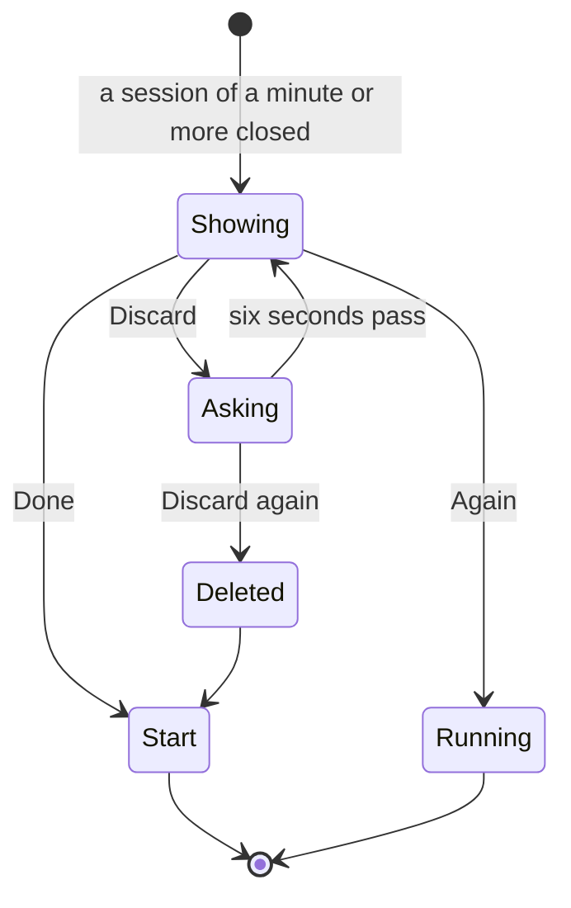

# The summary

What a session leaves behind, and the three things you can do about it.

## What you see

A scrolling screen, top to bottom:

1. One word — **"Complete"** or **"Ended"** — as a small uppercase label.
2. The session's studied time as a numeral, sized by the field it holds — 44pt for `35m`, stepping down to 34pt for `1h 30m`.
3. If the session touched more than one subject, a **breakdown**: one row per subject, a 6pt dot, the name, the time, largest first.
4. Two full-width glass capsules: **Done** in the accent, then **Again** in near-transparent white.
5. Below them, quiet and unadorned, a **Discard** link.

The breakdown appears on more than one *subject*, not more than one interval — a
session held once and resumed on the same subject has two intervals and one row,
which would just restate the total above it.

The two capsules are stacked rather than side by side. On a watch a full-width
capsule is a far easier target than half of one, and neither label has to shrink
to fit.

Discard is last, quiet and unadorned because throwing the session away is the
one action here that cannot be undone.

**Done** is the primary action and reads like one: first, and the only thing
here carrying the accent. Both capsules close the screen, and the one that
agrees with what just happened is the one almost everybody wants; repeating is
the deliberate choice, a thing to reach for rather than the thing that happens
by default. So the screen steps down in three: the one that agrees, the one
that asks for another, and the one that throws it away.

## What you can do

**Again** — secondary, under the accent — starts a new session with the same
length and the subject that was running when this one *ended*, not whichever
subject took the most of it.

**Done** closes the screen and returns to Start. It is this screen's primary
action, so the watch's **double tap** does it: the session is already banked by
the time this screen appears, and pinching twice is the way to agree with that
without a free hand. The gesture stays on Done even while the Discard question
is armed — leaving that question unanswered is safe, since the screen withdraws
it on the way out, and a double tap must never be what deletes a session. See
[`../foundations/input-model.md`](../foundations/input-model.md#the-double-tap).

**Discard** asks first. The first tap turns the word into "Discard?" and
brightens it a step; the second deletes the session's intervals. Six seconds
with no answer and it takes itself back. This is the same bargain the stop
button makes, and for the same reason: ending a session takes two taps on the
screen before this one, and a single tap here used to delete it.

## The five phases

**Compose**, **Commit** and **Run** are over.

**Close.** This screen *is* the close, made visible. It appears with a haptic —
success for a session the app calls Complete, the softer stop haptic for one
ended early.

That haptic is where the word at the top comes from, and the word is derived
from **studied time** — the same clock the countdown was showing. It used to be
derived from the wall-clock span, so a session held for long enough said
"Complete" and played the success haptic even though the countdown never reached
zero. See
[`../foundations/session-model.md`](../foundations/session-model.md#two-clocks-and-they-disagree)
and [B-02](../bug-triage.md#b-02).

**Account.** Leaving by any route drops the summary. The intervals stay in the
log unless Discard was tapped; if they had already reached the server their ids
are kept and the next sync deletes them there too, retrying while offline rather
than forgetting: [B-06](../bug-triage.md#b-06).

## Variants

| At the start | What differs |
| --- | --- |
| Timed, ran to term | "Complete", success haptic. |
| Timed, ended early | "Ended", stop haptic. |
| Timed, held long enough that the span covers the plan | "Ended". The hold is not study, and no longer counts as though it were. [B-02](../bug-triage.md#b-02) |
| Open-ended | Always "Ended". There was no plan to complete. |
| One subject, or free | No breakdown. |
| Several subjects | A breakdown, largest first, with free time as a row of its own in a neutral white rather than a palette colour. |
| Under a minute studied | This screen never appears. The session is deleted and the only sign is a retry haptic. |

| During | What differs |
| --- | --- |
| Discard armed | The label changes and brightens; six seconds later it does not. |
| Scrolled | Nothing else changes; the screen is static. |

## Interrupts

| Interrupt | Effect |
| --- | --- |
| Wrist down | The screen stays. An armed Discard withdraws itself before the wrist is back. |
| Crown press | Leaves the app. The summary is still queued on return — it is root state, not a sheet. |
| Session started elsewhere while this is up | Starting a session clears the queued summary, so the summary is lost rather than shown after. |
| 4am boundary | No effect. The session belongs to the day it started in. |
| Network loss | No effect. Sync happens later. |
| Killed and relaunched | The summary is lost. It lives in memory only. A session ended and then killed before the summary was read is simply gone from view — correctly banked, but never acknowledged. |

## Cross-cutting

**Always-On** — not designed for. The screen keeps its full layout dimmed,
including both glass capsules, which are not tappable while the wrist is down.

**Typography** — the total is the same hero numeral as everywhere else, sized by
the field it has to hold rather than by a fixed step: `35m` takes the full 44pt
display size and `1h 30m` comes down twice, because it is nearly twice the
advances wide. It was fixed at 34pt — the size for a numeral sharing a screen
with a navigation bar, which this screen does not have — which left the one
number the screen exists to report smaller than the buttons under it, whose
labels were set at footnote inside full-width capsules: [B-36](../bug-triage.md#b-36).
The capsule labels are body semibold. The gaps are set one at a time rather than
by a single stack spacing, because the screen is three things — a reading, a pair
of actions, a way out — and an even gap everywhere made it one list of five rows.
Breakdown rows
use footnote text with monospaced digits so the column of times aligns, and the
same `1h 30m` spelling as the numeral above them, because two spellings of one
quantity on one screen read as two different quantities.

**Motion** — the Discard label swaps through a blur, like every other changing
label in the app. Press states brighten and shrink.

**Haptics** — one on appearance, one on arming Discard, one on discarding.
Ending from the card with the app on screen fires the same one: the intent stays
quiet when a screen is about to speak, rather than firing success on top of it
[B-11](../bug-triage.md#b-11).

**Accessibility** — each breakdown row is combined into a single element, so
VoiceOver reads "Maths, 45 m" rather than three fragments. Discard keeps a stable
label and carries its armed state in a hint — "Double tap to confirm" — rather
than in the label text, which used to be the only signal. The button is declared
destructive but styled plain, so the role's usual colour never appears.

**What the widgets are told** — the session ended, so the snapshot loses its
live section and the card's relevance is invalidated. Discarding republishes
again with the day's total reduced.

## State diagram

## Open questions and verification

- Whether losing the summary when the app is killed matters. It is memory-only by design, but a session ended just before a crash is banked with no acknowledgement at all.
- Whether "Again" should also repeat *free* when the session ended free. It does — `lastSubjectID` is nil — but that is worth confirming reads as intended rather than as a lost subject.
- Whether the breakdown should appear for a single-subject session that was held, to show the shape of it. Currently it does not, deliberately.

Drafted against `watch/` commit `5ac0e35`, and revised after the fixes in [`bug-triage.md`](../bug-triage.md)
