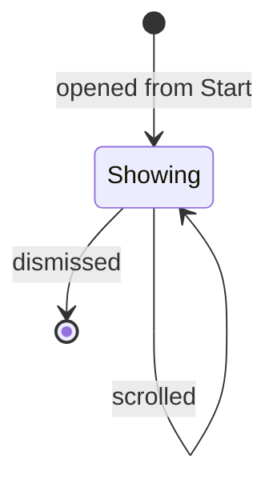

# Metrics

Three charts, all local, all offline. The full year stays on the web.

## What you see

A scrolling sheet titled **Metrics**:

**Today** — the day's total at 34pt, "of 2h 00m" beside it in tertiary, and a
streak in the corner when there is one worth showing. Under it, one row per
subject studied today: the name, the time, and a 3pt capsule scaled against the
biggest of them.

**This Week** — seven bars, Sunday to Saturday or wherever the locale puts its
first weekday, each 44pt tall with a ghost track behind it. A day that met the
goal is drawn in full copper; a day that did not is drawn at 68%. Bar width is
capped at 14pt and centred in whatever is left over, because seven bars
stretched across the full width read as blocks rather than as a chart.

**12 Weeks** — a heatmap, twelve columns of seven days, weekday down and week
across. Cells scale from 25% to 100% opacity of the same copper. Days in the
future are blank rather than empty.

Both charts read the same 91-day window, so the log is walked once and the
second chart is handed the same answer.

## What you can do

Nothing. Metrics is read-only: no tapping through to a day, no scrubbing, no
range selection. Scroll and leave.

## The five phases

Metrics is the **Account** phase made visible, and nothing else. It is reachable
only from the Start screen, so it can never be opened during a session — which
means the charts never have to show a session in progress.

Except that they do, because the day's total includes whatever is running. And
that reading is taken **once, when the sheet is built, and never again**: there
is no timeline here, so "Today" is frozen at the moment Metrics opened.
[B-09](../bug-triage.md#b-09).

## Variants

| At the start | What differs |
| --- | --- |
| Nothing studied today | The subject list is replaced by "Nothing yet." |
| Streak of 1 | Not shown. One day is not a streak; it is today, which the number below already says. |
| Streak of 2+ | Shown as "*n* day streak" in tertiary. |
| No history at all | Empty tracks and a blank heatmap; no dedicated empty state. |

| During | What differs |
| --- | --- |
| Scrolling | Nothing else changes. |
| Left open | Nothing updates. |

## Interrupts

| Interrupt | Effect |
| --- | --- |
| Wrist down | The sheet stays; nothing was moving anyway. |
| Crown press | Leaves the app with the sheet up. |
| Session started or ended elsewhere | The charts do not change. They were computed when the sheet opened. |
| 4am boundary | The charts do not change until the sheet is closed and reopened. |
| Network loss | No effect. Everything here is local, deliberately. |
| Killed and relaunched | The sheet is gone. |

## Cross-cutting

**Always-On** — the charts use the lit palette rather than the dimmed one, but
Metrics is a sheet over the Start screen and is not a screen anyone is expected
to glance at with the wrist down.

**Typography** — "of 2h 00m" uses the same spelling as the numeral it sits
against, at a wide enough gap to stay a separate phrase: at a tighter one the
unit and the goal ran together into `m of 2h 0m`. Subject times are monospaced
so the column aligns.

**Motion** — none. Nothing on this screen animates.

**Haptics** — none.

**Accessibility** — the subject rows combine into one element each, which is
right. The week bars are labelled with a single letter, so VoiceOver reads "M,
1 hour 5 minutes" rather than "Monday" — [B-15](../bug-triage.md#b-15). The
heatmap is one element labelled "Last twelve weeks" with no value at all, so a
quarter of a year of data is entirely unreadable without sight.

**What the widgets are told** — nothing. Metrics only reads.

## State diagram

## Open questions and verification

- Whether "Today" being frozen is noticeable in practice. It cannot be reached during a session from the app, but a session started from the Action Button leaves the Start screen reachable, so it can. [B-09](../bug-triage.md#b-09)
- Whether the streak's separate 400-day aggregation is worth its cost when both charts share a 91-day one. It is cached, so it is paid once per change rather than once per layout.
- Whether the week chart should show days in the future at all. It does, as empty bars.

Verified against `watch/` commit `5ac0e35`
