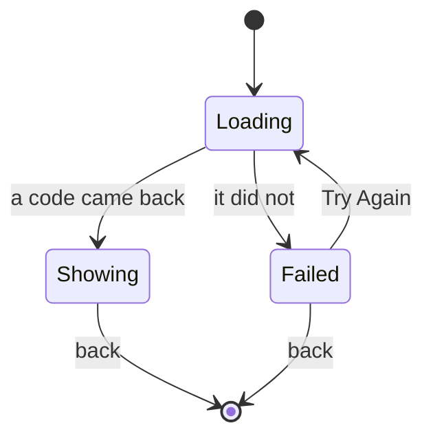

# Pairing

One screen, one code, and no way to tell whether it worked.

## What you see

Pushed from Settings, titled **Pair**. Three states:

| State | What is on screen |
| --- | --- |
| Loading | A spinner |
| Loaded | The code at 32pt with 2pt tracking, uppercased, and "Enter this on diem.app" under it |
| Failed | "Couldn't reach the server." and a "Try Again" button |

## What you can do

Read the code and type it on the web. Retry if it failed. Leave.

## The five phases

Pairing is outside the session model entirely. The app works fully without ever
pairing — every call in the sync layer is allowed to fail quietly, and nothing
in the product is gated on it.

## Variants

| At the start | What differs |
| --- | --- |
| Online | A code appears. |
| Offline | The failure message, and a retry. |
| Already paired | Identical. A fresh code is claimed every time the screen opens, and nothing indicates the watch is already paired. |

| During | What differs |
| --- | --- |
| The code is claimed on the web | **Nothing.** The screen does not change, and the watch is never told. |
| The code expires | **Nothing.** The server returns an expiry and the app discards it. |

## Interrupts

| Interrupt | Effect |
| --- | --- |
| Wrist down | The code stays on screen. |
| Crown press | Leaves the app; the code is claimed but unentered. |
| Session started or ended elsewhere | No effect. |
| 4am boundary | No effect. |
| Network loss | If it happens before the request, the failure state. If after, the code is already on screen and stays there whether or not it is still valid. |
| Killed and relaunched | The screen is gone and the code is lost. Reopening claims a new one. |

## Cross-cutting

**Always-On** — the code stays legible at 32pt.

**Typography** — the code is set in the numeral face with wide tracking, which
is right for something being transcribed. It is uppercased on screen.

**Motion** — none.

**Haptics** — none, including on failure.

**Accessibility** — the code is spelled out character by character rather than
read as a word, which is the right call for a code. It is spelled from the
*raw* string rather than the uppercased one, so if the server sends lowercase,
VoiceOver and the screen disagree in case: [B-23](../bug-triage.md#b-23).

**What the widgets are told** — nothing.

## State diagram

## Open questions and verification

- The screen never confirms success, so the only way to know pairing worked is to look at the web. [B-24](../bug-triage.md#b-24)
- The expiry the server returns is parsed and thrown away, so a stale code on screen looks exactly like a fresh one. [B-24](../bug-triage.md#b-24)
- No request timeout is configured, so on a flaky connection the spinner can sit for the URL session's default minute.

Verified against `watch/` commit `5ac0e35`
