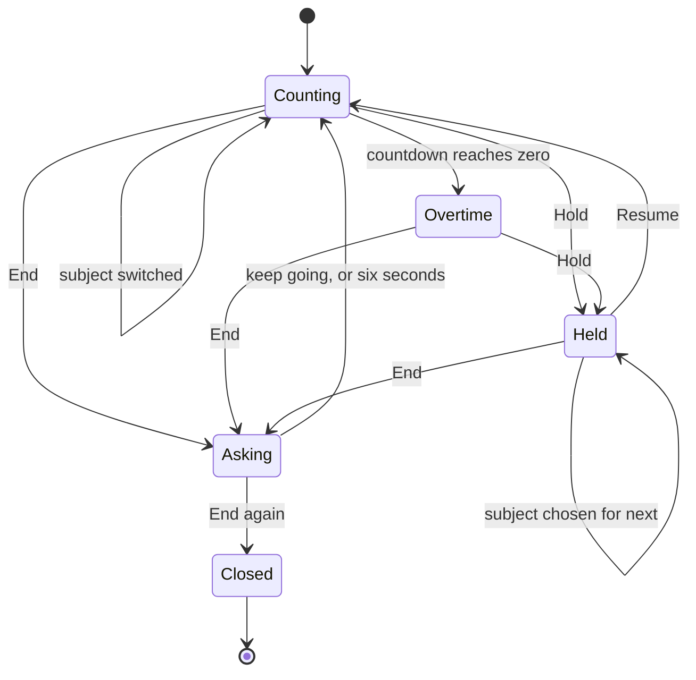

# The Running screen

The session while it runs. One number, one ring behind it, two controls.

## What you see

A **hero numeral** in the middle of the screen, at 44pt — the largest thing in
the app by a wide margin. Under it, the subject button with a coloured dot.
Behind both, a thin **session ring**.

What the numeral reads depends on the session:

| Session | Reads |
| --- | --- |
| Timed, running | Time left, counting down: `25:00` |
| Timed, past its deadline | Overtime, counting up with a sign: `+3:20`, at 60% opacity |
| Open-ended | Studied time, counting up: `07:41` |
| Held | Whatever it read when it stopped, at 45% opacity |

Above the numeral, one word when there is one to say: "Paused" while held,
"Complete" for two minutes after the countdown reaches zero. Paused outranks
Complete — a held clock is the more useful thing to be told.

The **session ring** behind the clock is not the goal ring from the Start
screen. It is this session so far, drawn as a bar of coloured bands — one per
run of study, as long as the run, in that subject's colour — bent into a circle,
one hour to the turn. Past an hour it goes round again over what is already
there. The bands use butt caps, not round: they abut, and a rounded end on each
would have every band bulge over its neighbour and read as a gap that is not
there.

**The session ring does not currently draw the right colours, because the file
does not compile.** See [B-01](../bug-triage.md#b-01) — this is the one finding
in this description that stops the app being built at all.

In the bottom bar, two 44pt circles pushed to opposite edges: **Hold** on the
left, **End** on the right in the accent. The thumb reaches either without
crossing the numeral, and each keeps its full target.

## What you can do

**Tap Hold** to stop the count where it is. The whole screen steps back
together — the numeral fades to 45% and the subject button with it — rather than
leaving one small word to carry the state, because a frozen count still reads as
a count.

**Tap Hold again** to resume. Both fire the same click, so hold and resume are
indistinguishable by feel.

**Tap the subject button** to switch what is being studied. Running, that closes
the current interval and opens a new one immediately. Held, the choice waits for
the next interval rather than rewriting a record the server may already hold.

**Tap End**, and then tap again. The first tap arms the question: the stop glyph
becomes a checkmark, the Hold control becomes an ✕ meaning "keep going", and
"End?" appears in the gap between them. Nothing on screen moves. Six seconds
with no answer and the question withdraws itself.

There is no way from here to Settings, to Metrics, or back to the Start screen.
The session is the screen until it ends.

## The five phases

**Compose** and **Commit** happened elsewhere.

**Run.** The clock redraws once a second, or once a minute while dimmed or held
— a per-second schedule against a display that refreshes once a minute only
burns budget, and a frozen numeral does not need refreshing at all.

Every redraw takes **one** reading of the session and passes it down. Nothing
below asks the store again, and the store answers from a cache rather than the
database, because a fetch and a session assembly behind every read would put the
database on the critical path of the numeral roll.

When the countdown crosses zero the success haptic fires and "Complete" appears
for two minutes of studied time. The session does not end — it rolls into
overtime, which is a real thing to do. A local notification also fires at the
deadline, and another half an hour later asking whether the session was
forgotten, because the in-app haptic only fires while this screen is drawn.

**Close.** The second tap on End. Every open interval is closed at the same
instant; under a minute of studied time the session is deleted and the only
acknowledgement is a softer haptic; otherwise the root crossfades to the
summary.

**Account.** Not this screen.

## Variants

| At the start | What differs |
| --- | --- |
| Timed | Counts down. Has a deadline, an alert, and a Complete state. |
| Open-ended | Counts up. No deadline, no alert, no Complete — and no way to know how long you meant to go. |
| Free | The subject button reads "Free" with no dot. Mid-session there is no subject to go and pick; running without one is what a free session *is*. |
| Reopened mid-session | Lands here directly, with no Start screen behind it. |

| During | What differs |
| --- | --- |
| Held | Numeral at 45%, "Paused" above it, Hold becomes Resume. The notification is cancelled. |
| Overtime | Numeral at 60% with a `+`. The nudge notification is still ahead. |
| Question armed | Both controls change meaning; "End?" between them. |
| Dimmed | Both controls are removed. The numeral loses its seconds — they slide out to the trailing edge and what is left recentres — and the tick drops to once a minute. |
| Held *and* overtime | "Paused" wins. A session past its deadline and held is not measuring either. |

## Interrupts

| Interrupt | Effect |
| --- | --- |
| Wrist down | The app keeps the foreground, so the raise comes back here rather than to the watch face. Seconds leave; controls leave; the tick slows to a minute. An armed question will have withdrawn itself. |
| Crown press | Leaves the app and gives up the hold. The session keeps running. Returning lands here again. |
| Session ended elsewhere | Should leave for the summary or the Start screen. May not, per [B-03](../bug-triage.md#b-03) — the screen can be left showing a stopped clock labelled "Paused", and Resume will revive an ended session. |
| 4am boundary | No effect here. The session counts wholly toward the day it started in. |
| Network loss | No effect. |
| Killed and relaunched | Lands here again with the count intact, as long as the open interval is under twelve hours old. Past that the session is disowned and the app opens on Start. |

## Cross-cutting

**Always-On** — this is the screen Always-On was designed around. It is the same
clock with its seconds taken off, not a screen of its own: the last two digits
slide out to the trailing edge, what is left recentres in the space they gave
up, and they slide back on the wake. One layout means the reading never changes
units, size or place between lit and dimmed. Nothing else moves — a roll queued
against a display that refreshes once a minute lands as stutter on the next wake.

**Typography** — 44pt, or 38pt once the field grows past six characters, chosen
by the *field* rather than by the value so the clock never resizes mid-session
as digits roll. Colons are set inside the same text run at tertiary and lifted
6% of the size, because a colon is centred on the x-height while the digits are
lining figures and would otherwise sit low.

Two seams here are worth checking on a device. Overtime under an hour adds a
glyph — `25:00` to `+00:07` — without dropping a size step,
[B-16](../bug-triage.md#b-16). And an open-ended session crossing one hour
changes field, face size *and* digit-group count between one second and the
next; the app handles this as a replace rather than a roll, which is right, but
it is a large change to make at 44pt.

**Motion** — the numeral rolls with a countdown-aware transition, because a
count's direction is fixed and its magnitude means nothing. Changing quantity —
`0:00` to `+0:00` — is a blur replace instead, because those are different
numbers in different fields.

**Haptics** — click on hold, resume, arm and withdraw; success at the deadline;
success or stop when the summary opens; retry if the session was under a minute.

**Accessibility** — the numeral speaks its reading in words. The session ring
carries nothing at all, so the breakdown it draws is invisible to VoiceOver. The
"End?" label is laid out at its intrinsic size with no room to shrink, so large
watch text sizes push the bottom bar past the screen:
[B-14](../bug-triage.md#b-14).

**What the widgets are told** — every hold, resume and subject switch
republishes the snapshot. Only a start, an end, or a moved deadline invalidates
the card's relevance.

## State diagram

## Open questions and verification

- Whether "END?" plus two 44pt controls fits the bottom bar at the largest watch text size. Read from the code it does not: [B-14](../bug-triage.md#b-14).
- Whether the 44pt face plus a `+` sign overruns the ring behind it on a 41mm watch.
- Whether the deadline notification is presented at all now that the app holds the foreground for the whole session. Nothing sets a notification-centre delegate, so a notification arriving while the app is frontmost is likely suppressed: [B-18](../bug-triage.md#b-18).
- Whether the colon's baseline lift changes the line height enough to shift the numeral off the ring's centre.

Verified against `watch/` commit `5ac0e35`
