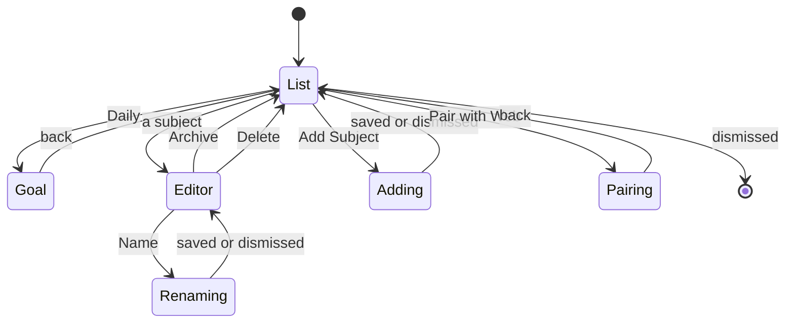

# Settings

Three sections, a subject editor behind one of them, and the pairing screen
behind another.

## What you see

A list titled **Settings**:

| Section | Rows |
| --- | --- |
| **Goal** | "Daily", with the current goal on the right, pushing to the goal screen |
| **Subjects** | Every subject, archived ones included, sorted by name; then "Add Subject" — which refuses a name already in use |
| — | "Pair with Web" |

Subjects are sorted **by name** here, not by recency as they are in the picker.
A list you are managing has to hold still: adding one put it at the far end from
the button just pressed, and renaming or recolouring one moved it out from under
the thumb. The sort is localised and number-aware, so `Set 2` comes before
`Set 10` and case does not decide the order.

An archived subject is dimmed, its dot at 40%, with a small archive box at the
trailing edge — colour is never the only signal.

## The goal screen

One number at 34pt with "per day" under it, and the crown. 48 steps of 15
minutes, 15 minutes to 12 hours. The title size rather than the hero size,
because this screen carries a navigation bar and `12h 45m` at display size would
run into both edges.

The crown position is seeded when the screen is built, not on appearance —
assigning the stored goal after the first render would register as a crown
movement and fire a detent nobody made.

Every detent writes the setting immediately, so the number on screen is always
the truth. The **widgets** are told 400ms after the crown settles, and again on
leaving: one pass of the crown is forty-seven detents, and republishing each one
would write the snapshot file and wake the widget daemon forty-seven times for a
number still being chosen.

## The subject editor

Pushed from a subject row, titled with the subject's name:

| Section | What |
| --- | --- |
| — | "Name", with the current name; tapping opens a text field |
| **Color** | Ten swatches in a grid |
| — | "Archive"/"Unarchive", and "Delete"; footer explaining archiving |

The colour grid is not laid out as a list row. Inside one it kept the row's
inset and rounded fill, which boxed the swatches into a pill; it takes the width
of the screen instead. The selected swatch is ringed *outside* its edge rather
than on its rim, because a 2pt stroke on a 24pt circle eats an eighth of the
colour it is meant to be marking.

**Delete asks twice**, on the same question the summary's Discard uses: one tap
arms it, a second deletes, and six seconds unanswered takes it back. It used to
be a single tap that popped the screen, while the far less consequential Discard
asked ([B-21](../bug-triage.md#b-21)). The footer explains deleting as well as
archiving now — history is kept either way, which is the thing people are least
sure of.

## What you can do

Change the goal. Add, rename, recolour, archive and delete subjects. Start
pairing. Nothing else — there is no notification setting, no Always-On setting,
no way to change the 4am boundary, and no way to export.

## The five phases

Settings sits outside the session's five phases entirely. It is reachable only
from the Start screen, so it can never be opened while a session is running.

## Variants

| At the start | What differs |
| --- | --- |
| No subjects | The Subjects section is just "Add Subject". |
| Ten or more subjects | The eleventh takes the least-used colour. It used to take the first one's, always. [B-22](../bug-triage.md#b-22) |
| Unpaired | "Pair with Web" fetches a fresh code each time it is opened. |

| During | What differs |
| --- | --- |
| Goal crown turning | The number and the ring behind the Start screen update at once; the widgets wait for the crown to settle. |
| A subject renamed | The list re-sorts. The editor's own title follows. |
| A subject archived | It stays in this list, dimmed; it leaves the picker. |

## Interrupts

| Interrupt | Effect |
| --- | --- |
| Wrist down | Standard list dimming. A goal being scrubbed keeps its value. |
| Crown press | Leaves the app. A goal detent already made is already saved. |
| Session started elsewhere | Settings is a sheet over the Start screen; the root beneath it changes to Running while the sheet stays up. |
| 4am boundary | No effect. |
| Network loss | Only pairing notices, and it says so. |
| Killed and relaunched | Settings is gone. Everything committed here was written as it happened. |

## Cross-cutting

**Always-On** — standard lists.

**Typography** — the goal row and the goal screen spell the number the same way,
deliberately: the spoken formatter drops the zero padding, which would put
`2h 0m` in the row against `2h 00m` on the screen behind it.

**Motion** — standard navigation. The colour grid has none: a swatch is chosen
with a click and the ring moves without animation.

**Haptics** — a click per goal detent and per colour chosen. Adding, renaming,
archiving and deleting a subject are all silent.

**Accessibility** — the archive state is carried by an icon as well as by
opacity, which is right. Each swatch is named ("Lime", "Teal") and the current
one carries the selected trait, where the grid used to be ten unnamed buttons.
Swatch cells are 44pt, up from 34: [B-13](../bug-triage.md#b-13).

**What the widgets are told** — only the goal, and only once the crown settles.

## State diagram

## Open questions and verification

- Whether the six-second question is the right length for Delete, where the consequence is smaller than Discard's but the wording is scarier.
- A deleted subject now reaches the server, because the push includes tombstones: [B-05](../bug-triage.md#b-05).
- Duplicate names are refused as they are typed, with "Already used." under the field: [B-20](../bug-triage.md#b-20). Whether refusing is better than disambiguating is still a product call.
- The name field has no length limit, and every screen that shows a name truncates to one line.

Drafted against `watch/` commit `5ac0e35`, and revised after the fixes in [`bug-triage.md`](../bug-triage.md)
