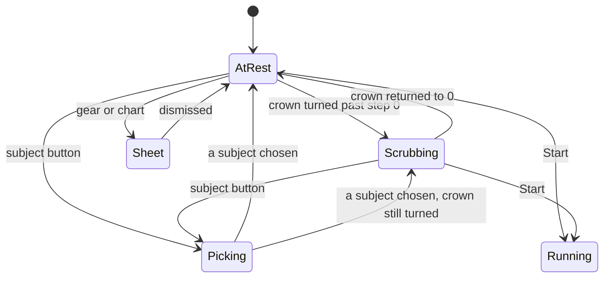

# The Start screen

The pilot document. Everything else copies its depth.

Where the app rests when nothing is running. One ring, one number, four
controls.

## What you see

A **ring** filling most of the display, with the day's total in the middle of
it. Around the edge, four controls in two bars:

| Position | Control |
| --- | --- |
| Top leading | A gear — Settings |
| Top trailing | A bar chart — Metrics |
| Bottom leading | The **subject button**: a coloured dot, a name, a chevron |
| Bottom trailing | A filled orange circle with a play glyph — **Start** |

The ring at rest is **today against the goal**. One turn is the goal met; past
it, it laps. The track behind it is white at 10%, not a dim orange — a
desaturated accent would read as a second data value rather than as an empty
groove.

The number inside is today's total, spelled `45 m` under an hour and `1h 30m`
over it. It is sized to the ring rather than to the type scale: at a normal
title size it read as a caption in a large empty circle.

The ring is deliberately not centred geometrically. The bottom bar carries a
filled accent circle and the top two small outlined glyphs, so the heavier edge
pulls the eye down; the ring is lifted 12pt to sit at the optical centre of what
is actually on screen. It is also allowed to overrun the bars slightly, the way
an Activity ring does, because it is bounded by the height between them rather
than by the width.

If no subject has been chosen the button reads a dimmed "Subject" with no dot.
If the last-used subject has since been archived or deleted, it reads "Subject"
too — the screen will not offer a subject that Settings has got rid of.

## What you can do

**Turn the crown** to set a session length. Step 0 is no length at all; turning
past it puts the ring into scrub mode, where one turn is an hour rather than the
goal, and the number in the middle becomes the duration being set rather than
the day's total. The two are different quantities, so the swap is a blur, not a
roll — rolling one into the other would read as the number counting itself down.

The system's own crown indicator is hidden here. The ring is welded to the crown
and is the largest thing on the screen; the green bar down the right edge said
the same thing again, smaller, over the top of it ([B-38](../bug-triage.md#b-38)).
The Goal screen keeps its indicator — there is no ring there.

The arc tracks the crown continuously; the number and the click land on whole
minutes. See [`../foundations/input-model.md`](../foundations/input-model.md).

**Tap the subject button** to open the picker. **Tap Start** to commit. **Tap
the gear or the chart** for Settings and Metrics.

The Start control's spoken label changes with the crown: "Start" at rest,
"Start 25m" once a length is set.

## The five phases

**Compose.** The crown and the subject button. Neither writes anything to the
log — the length lives in the view, and the subject is remembered in defaults
only once a session actually starts. Coming back to this screen re-reads the
last-used subject, unless the picker has already been opened this visit, so an
explicit choice of "Free" is not silently overwritten.

**Commit.** One tap. An interval is inserted carrying the session id, the chosen
subject and the length; the start haptic fires; the crown is reset to zero; the
root crossfades to the Running screen.

The reset is made silently — the app suppresses the click its own reset would
otherwise cause, by comparing the crown's value against the one it just set
rather than by latching a flag. Latching it meant a crown turned less than half a
step armed a suppression that no reset ever fired, and it swallowed the *next*
real detent instead: [B-12](../bug-triage.md#b-12).

**Run.** Not this screen. The root switches wholly.

**Close.** Not this screen.

**Account.** Coming back, the ring and the number have grown by whatever the
session banked.

## Variants

| At the start | What differs |
| --- | --- |
| No subjects exist at all | The button reads "Subject"; the picker offers only "Free" and a footer pointing at Settings. |
| A subject was used last time | It is pre-selected, with its dot. |
| That subject has since been archived or deleted | The button falls back to "Subject", and starting produces a free session. |
| Crown at rest | Open-ended session. The ring shows the day. |
| Crown turned | Timed session. The ring shows the duration, in the accent at 72% rather than the ring copper. |
| Goal already met | The ring is closed before anything is added; further study laps it. |

| During | What differs |
| --- | --- |
| Crown turning fast | The arc stays welded to the crown; the numeral rolls per minute. Minutes are zero-padded so the `h` and `m` labels do not skate sideways. |
| Dimmed | The four controls fade out where they stand. Both bars keep their height, so the ring is the same size and in the same place lit or dimmed. |
| A sheet is open | The screen behind is unchanged, and the crown is claimed again when the last sheet closes — it used to be claimed once, on appearance, and never reclaimed: [B-12b](../bug-triage.md#b-12). |

## Interrupts

| Interrupt | Effect |
| --- | --- |
| Wrist down | Controls fade out; the ring stays exactly as it was; the numeral stops rolling. A length being scrubbed is kept. |
| Crown press | Leaves the app. A length being scrubbed is lost on the next launch. |
| Session started elsewhere | The root should switch to Running. It will, if the app is in the foreground; if the app was alive in the background it may not, per [B-03](../bug-triage.md#b-03). |
| 4am boundary | The total and the ring reset on the next minute tick. The screen re-reads once a minute, so this lands within 60 seconds. |
| Network loss | No effect. |
| Killed and relaunched | Lands here with the crown at zero and the last-used subject restored. |

## Cross-cutting

**Always-On** — the ring is the whole screen, and it is the *same* ring: same
diameter, same place, the four controls around it simply fading out inside bars
that keep their height. The bars used to be removed instead, which handed the
content area both of their heights at once and made the crossing most of a
ring's diameter arriving in a single frame — a ring that resizes on the way into
Always-On reads as a different reading, when it is the same day shown the same
way. What crosses now is the palette stepping down and the controls fading, on
the same short critically damped spring: the display drops to about one refresh
a minute on the way down, and anything with overshoot risks being caught
mid-bounce and held there. The numeral holds still.

**Typography** — the total is a hero numeral at 40pt with −1.0 tracking, always
monospaced digits, the field reserved at its widest value so nothing shifts.
Over an hour the units are drawn separately at 36% of the numeral so the digits
lead. The field reserves one hour digit below ten hours and two above, so a
reading fills the box it was given — it used to reserve two always, which left
every real total sitting narrower than its own field:
[B-17](../bug-triage.md#b-17).

**Motion** — entering and leaving scrub mode is one event, so the ring and the
numeral leave on the same curve. They used to leave on different ones, which is
close enough to look like a mistake rather than a choice.

**Haptics** — a click per detent, and the start haptic on commit.

**Accessibility** — the ring and numeral are one element, labelled "Today" or
"Session length" depending on mode, and it speaks progress against the goal as a
percentage — "1 hour 5 minutes of 2 hours, 54 percent". That value was missing
entirely: [B-15](../bug-triage.md#b-15). The crown still has no adjustable
action, so setting a length without a crown is not possible.

**What the widgets are told** — nothing changes here until a session commits.

## State diagram

## Open questions and verification

- Whether reclaiming crown focus when the last sheet closes actually restores it, or whether the focus has to be dropped and re-taken. [B-12b](../bug-triage.md#b-12).
- Three sheets are attached to the same view. Modern SwiftUI generally handles this, but stacked `sheet(isPresented:)` modifiers on one view have historically been unreliable; this wants a device before it is called fine.
- Whether the "Not saving" banner ever appears in practice. It is the visible half of [B-04](../bug-triage.md#b-04) and is reachable only by corrupting the store; its milder sibling, "Complication not updating", is what an unprovisioned App Group looks like.
- Whether the −14pt vertical overrun clips the ring against the bezel on the 41mm watch.
- Whether the optical 12pt lift still reads as centred in Always-On. The bars now stay, so the ring does not move — but the controls it was correcting for are no longer drawn, and the Running screen answers the same question by sliding its picture down to the middle. Whether this screen should do the same wants a wrist.

Drafted against `watch/` commit `5ac0e35`, and revised after the fixes in [`bug-triage.md`](../bug-triage.md)
