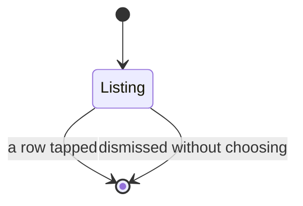

# The subject picker

A sheet, opened from either the Start screen or the Running screen.

## What you see

A navigation stack titled **Subject**, holding one list: every visible subject,
then a row called **Free**. Each row is a coloured dot, a name, and a checkmark
on the one currently selected.

Archived and deleted subjects are not here. Archiving is exactly this: hidden
from the picker, history kept.

With no subjects at all, the list is one row — Free — under a footer reading
"Add subjects in Settings." The footer is a footer rather than a second section,
because in a section of its own it drew as a row: inset, filled, and looking
like something to tap.

## What you can do

**Tap a row.** That is the whole screen. There is no way to add a subject from
here, no way to rename one, and no explicit Cancel — dismissing without choosing
is a swipe or a crown press.

## The five phases

**Compose.** From the Start screen the choice is held in the view and applied to
the next session. Choosing here also marks the screen as chosen, so an explicit
"Free" is not overwritten by the last-used subject when the screen next appears.

**Commit.** From the Running screen the choice takes effect immediately: running,
it closes the open interval and opens a new one under the new subject, back to
back, so a new run begins in the ring behind the clock. Picking the subject
already running does nothing at all.

**Run.** Held, the choice is remembered for the next interval rather than
applied to the closed one, because that record may already be on the server.

**Close** and **Account** — not this screen.

## Variants

| At the start | What differs |
| --- | --- |
| Opened from Start | Selection is whatever the Start screen currently offers. |
| Opened from Running | Selection is the live session's subject, or the one chosen while held. |
| No subjects | One row, plus a footer pointing at Settings. |

| During | What differs |
| --- | --- |
| Session running | The pick closes an interval and opens another. |
| Session held | The pick waits. Nothing in the log changes until resume. |
| The same subject picked | No-op, from either screen. |

## Interrupts

| Interrupt | Effect |
| --- | --- |
| Wrist down | The sheet stays. |
| Crown press | Leaves the app with the sheet still presented. |
| Session ended elsewhere | The picker is still up over a screen that no longer applies. Picking then writes to a session that has ended. |
| 4am boundary | No effect. |
| Network loss | No effect; the list is local. |
| Killed and relaunched | The sheet is gone. Nothing was written. |

## Cross-cutting

**Always-On** — a standard list, dimmed by the system.

**Typography** — body text, one line, truncating. Two subjects can no longer
share a name, so a row is never ambiguous: the name field refuses one already in
use. [B-20](../bug-triage.md#b-20).

**Motion** — standard list presentation.

**Haptics** — none. Picking a subject is the one commitment in the app that
gives no feedback of its own; the only signal is the sheet closing.

**Accessibility** — each row is one element labelled with the subject's name,
and the current one carries the selected trait, so VoiceOver announces it the way
it announces any other selection. The checkmark used to be the only signal, and
it is decorative. [B-15](../bug-triage.md#b-15)

**What the widgets are told** — a switch mid-session republishes the snapshot,
so the card's subject name changes. It does not invalidate relevance, which is
correct: the claim has not moved.

## State diagram

## Open questions and verification

- Rows are 44pt, up from 40: [B-13](../bug-triage.md#b-13).
- The row owns its dismissal; both callers stopped clearing the flag underneath it: [B-19](../bug-triage.md#b-19). Whether that removes the double animation wants a device.
- Whether a picker with no way to add a subject is the right shape, given the Running screen cannot reach Settings.

Drafted against `watch/` commit `5ac0e35`, and revised after the fixes in [`bug-triage.md`](../bug-triage.md)
