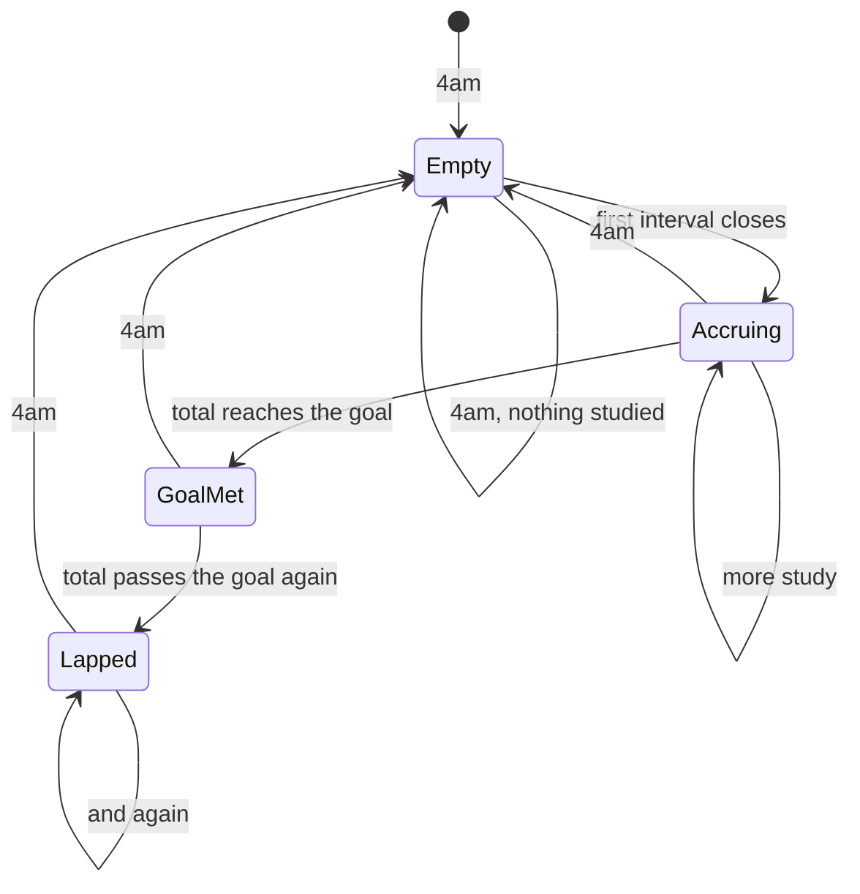

# The day model

Owns: the 4am boundary, the goal, what a lap is, and how the streak counts.

## What you see

One number and one ring on the Start screen, and three charts in Metrics. All of
them are the same day, bucketed the same way.

## The study-day

A day runs **04:00 to 03:59 local**. A session counts toward the day it started
in, so a session begun at 01:30 belongs to the day before — which is what
somebody working late would say themselves.

Everything is stored in UTC and bucketed by the local day in effect at the time.
The boundary is computed by shifting back four hours, taking the start of that
day, and shifting forward four again, so it follows the local calendar through
daylight saving rather than assuming 24-hour days.

## The goal

One number, 15 minutes to 12 hours, default 2 hours, stored in the shared
defaults so the widget extension can read it too. It is the only setting that
leaves the app: it travels to the server as a header on every sync, because the
web's goal-hit rate needs a copy of it.

## Laps

A reading against the goal does not stop at the goal, it **laps**. One turn is
the goal met exactly. Past it the completed pass dims to 42% and the overflow
draws over the top of it, so a day at 150% shows a full dimmed ring with half a
bright one over it.

Exactly one turn is a full reading, not a lap — the dimmed pass only appears
once there is something to draw over it. A whole number of laps reads full,
never empty.

The ring on the watch and the bar on the rectangular complication are the same
lap in two shapes, and both take it from the same place, so they cannot drift.

## The streak

Consecutive study-days with anything at all in them, counting back from the most
recent. **Today having nothing in it yet does not break it** — a streak you are
in the middle of is still a streak, and a counter that resets every morning
until you sit down is a counter nobody would trust.

It is measured over a 400-day window, so a streak longer than that stops
growing. That is a stated limit, not a defect.

The streak is shown only at 2 days or more. One day is not a streak; it is
today, which the number beside it already says.

## The five phases

The day model has no phases of its own — it is what the Account phase writes
into. Every closed interval lands in exactly one study-day bucket, decided by
where its *session* started.

## Variants

| At the start | What differs |
| --- | --- |
| Goal met already | The ring is a full turn before anything is added; the next session laps it. |
| Goal set to its minimum | 15 minutes fills the ring, so a single short session laps. |

| During | What differs |
| --- | --- |
| A session crossing 4am | Stays in the day it started. The day's total therefore *keeps growing past the boundary* for as long as the session runs, while a session started after 4am would be counted in the new day. |
| Goal changed mid-session | The ring rescales immediately. The widgets are told 400ms after the crown settles, not on every detent. |

## Interrupts

| Interrupt | Effect |
| --- | --- |
| Wrist down | None. |
| Crown press | None. |
| Session started or ended elsewhere | The totals are correct in the database; whether the *app* shows them is [B-03](../bug-triage.md#b-03). |
| 4am boundary | The day's banked total resets to zero. In the app this is picked up on the next read. In the widgets it is not picked up at all until the next refresh, which can be half an hour: [B-07](../bug-triage.md#b-07). |
| Network loss | None. Every chart is local. |
| Killed and relaunched | None. The day is derived from the log. |

## Cross-cutting

**Always-On** — the ring keeps drawing; the numeral holds still. Nothing rolls
while dimmed, because the display refreshes about once a minute and a queued
roll lands as stutter on the next wake.

**Typography** — the day's total is a hero numeral inside the ring, sized to the
ring rather than to the type scale.

**Motion** — a recorded total arrives infrequently, so it settles on a soft
spring (0.5s response) rather than snapping. Under the crown the ring is not
animated at all, because direct manipulation must never be.

**Haptics** — none. Reaching the goal is not marked, which is a deliberate
quiet: the ring closing is the signal.

**Accessibility** — the ring itself carries no value. The container is labelled
"Today" and the numeral speaks the total, so the *progress against the goal* —
the thing the ring exists to show — is never announced: [B-15](../bug-triage.md#b-15).

**What the widgets are told** — the snapshot carries the banked total and the
goal, but no day identity, which is why the boundary cannot be detected on the
other side.

## State diagram

## Open questions and verification

- The boundary has been tested across a DST change only in the abstract; the calendar arithmetic is exercised by unit tests in UTC, which is where DST does not exist.
- Whether a session that crosses 4am *should* keep adding to the previous day's total for hours is a product call. It follows from the stated rule, but it means the ring can keep filling after the day it belongs to has ended.

Verified against `watch/` commit `5ac0e35`
