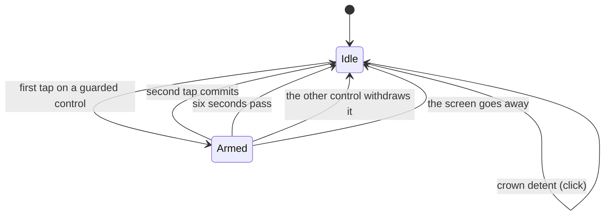

# The input model

Owns: the crown curves, what a detent is, tap targets, how a question works,
and which haptic means what.

## What you see

Two kinds of control, and one kind of question.

**Circle controls** — 44×44pt glass circles in the bottom bar. Tinted when they
commit something, plain when they do not. Pressing one brightens it 8% and
shrinks it to 96%; Reduce Motion keeps the brightness and drops the scale, so
the press still answers without the thing under the finger changing size.

**Borderless controls** — the subject button, the Discard link. No background,
no border; the target comes from padding.

**Questions** — a control that has been tapped once and is waiting for a second
tap. See below.

## What you can do

### The crown

Two screens bind the crown, and both bind it the same way: a **continuous**
value, detented, with the system's own haptics turned off.

> Technical note: no `by:` stride. A detented binding already hands back whole
> steps; a stride on top of that is what made the arc move in visible jumps. The
> value comes back continuous, the ring tracks it directly, and the *reading* is
> rounded to the nearest whole step.

**Session length**, on the Start screen — 113 steps, 0 to 8 hours:

| Steps | Each step is | Reaching |
| --- | --- | --- |
| 0 → 60 | 1 minute | 1 hour |
| 61 → 96 | 5 minutes | 4 hours |
| 97 → 112 | 15 minutes | 8 hours |

Step 0 is "no length" — an open-ended session, and the state the crown rests in.

**Daily goal**, in Settings — 48 steps of 15 minutes, 15 minutes to 12 hours.

Both curves round-trip: a duration converted to a step and back is the same
duration. That is tested.

### The crown hint

The crown is the Start screen's main control and nothing said so: a ring with a
number in it is a reading, not an invitation, and the one gesture that sets a
length was discoverable only by accident.

So a small crown glyph sits beside the Digital Crown itself — a **crown
accessory**, drawn by the system at the crown's position rather than laid out on
the screen, which is why it costs the ring nothing. It bobs two points along the
axis the crown turns, slowly enough to read as an invitation rather than an
alert. It is the only repeating animation in the app.

It shows while the crown is at rest and the screen is lit, and it is gone the
moment the crown is turned — the scrub happens against a clean edge, which is
the point of hiding the system's indicator in the first place. Reduce Motion
keeps the glyph and drops the bob. VoiceOver is told nothing: the ring beside it
already carries the label and the value.

The Goal screen has no hint and keeps the system's own indicator instead. There
is no ring there for the bar to talk over.

### Detents

A **detent** is one whole step. The number on screen and the haptic land on
detents; the ring does not — it tracks the crown continuously between them, so
the arc stays welded to the wrist while the reading still lands on exact
minutes. One click per detent, and none for a step the app made itself.

### Targets

The stated floor is 44pt, and everything meets it. Two places used not to — the
subject picker's rows at 40pt and the colour swatch cells at 34pt:
[B-13](../bug-triage.md#b-13).

### The double tap

The watch's own gesture — pinch the index finger and thumb twice — runs the
**primary action** of whatever screen is in front of you. All three root
screens declare one:

| Screen | What a double tap does |
| --- | --- |
| Start | Starts the session the screen is composed for: the subject shown, and whatever length the crown is holding. |
| Running | Holds the session, and holds it again to resume. |
| Summary | Done — banks the session and goes back to Start. |

A screen gets one, so the choice is what a free hand would be reaching for. On
the Running screen the gesture stays on the left control across the End
question, where that control's meaning has inverted to "keep going" — a double
tap can take a question back, and must never be the thing that ends a session.

On the summary it is Done rather than Again for the same reason: both close the
screen, and the one that finishes what just happened is the one almost everybody
wants. It stays Done while the Discard question is armed — the question dies
unanswered when the screen goes, which is safe, and the gesture must never be
what deletes a session.

The gesture is answered by whatever is in front of you, so it is withdrawn while
a sheet — the picker, Settings, Metrics — is up. It fires the control's own
action, which means it fires the control's own haptic: a double tap that starts
a session feels exactly like a tap that starts one.

### Questions

Three things ask before they act: the stop button on the running screen, Discard
on the summary, and Delete in the subject editor — which used to be a single tap
([B-21](../bug-triage.md#b-21)). All three work identically.

1. First tap **arms** the question and clicks.
2. The control changes: stop becomes a checkmark, Discard becomes "Discard?".
3. A second tap commits.
4. **Six seconds** with no second tap and the question withdraws itself.
5. Leaving the screen withdraws it too.

The withdrawal is the interesting part. A question left standing on a wrist is
an accident waiting for the next tap, so it takes itself back — but it takes
itself back *silently*, and nothing on screen counts down to it.

On the running screen the question is asked between the two controls that answer
it: the left control becomes the way out, the right one becomes the commitment,
"End?" appears in the gap, and nothing moves. The thumb is already where it
needs to be.

## The five phases

**Compose** — the crown sets the length, the subject button sets the subject.
**Commit** — one tap on the accent circle. **Run** — hold, switch, and the
two-tap end. **Close** — the second tap. **Account** — no input.

## Variants

| At the start | What differs |
| --- | --- |
| Crown at rest (step 0) | The Start control reads "Start" and commits an open-ended session. |
| Crown turned | The control reads "Start 25m"; the ring is in scrub mode and the numeral is the duration, not the day. |

| During | What differs |
| --- | --- |
| Question armed | The left control's meaning inverts from Hold to "Keep going" — and the double tap inverts with it, because it is that control's action, not the hold's. |
| A sheet open | The screen's primary action is withdrawn; the double tap does nothing until the sheet closes. |
| Reduce Motion | Press scale is dropped; label swaps fade instead of blurring; digit rolls become fades. |
| Dimmed | Every control is removed from the screen, so there is nothing to press. |

## Interrupts

| Interrupt | Effect |
| --- | --- |
| Wrist down | Controls leave the screen entirely — faded to nothing *and disabled*, so the primary action goes with them and a double tap has nothing to run until the wrist is back up, which is also when the gesture is delivered. A question keeps its six-second clock and will have withdrawn itself before then. |
| Crown press | Leaves the app. Nothing is committed. |
| Session started or ended elsewhere | No effect on input state, but the screen underneath may be describing a session that is over — see [B-03](../bug-triage.md#b-03). |
| 4am boundary | No effect. |
| Network loss | No effect. Nothing here waits on the network. |
| Killed and relaunched | Crown position, armed questions and unchosen subjects are all lost. The crown returns to step 0, so a relaunch mid-compose loses the length being set. |

## Cross-cutting

**Always-On** — controls are not dimmed, they are removed. Nothing is tappable
while the wrist is down, so nothing is drawn — which also lets the ring take
back the height the bars were using.

**Typography** — control labels are system-sized; the "End?" question is a
caption in uppercase with tracking. It shrinks, and then yields its space
entirely, rather than pushing the two 44pt controls past the screen edge at large
watch text sizes — which is what it used to do, being laid out at its intrinsic
size: [B-14](../bug-triage.md#b-14).

**Motion** — presses use a fast, slightly bouncy spring (0.22s response); state
changes use a critically damped one (0.35s). Springs rather than easing curves
throughout, because a spring blends velocity when it is interrupted and an
easing curve restarts with a visible seam.

**Haptics** — five, and they mean different things:

| Haptic | Fired by |
| --- | --- |
| Click | Every crown detent; arming or withdrawing a question; picking a colour; holding and resuming. |
| Start | Committing a session, from any surface. |
| Success | The countdown reaching zero, and a summary opening for a session the app calls Complete. |
| Stop | A summary opening for a session that was ended early. |
| Retry | A session dropped for being under a minute, and a discard. |

Holding and resuming both fire a plain click, so hold and resume are
indistinguishable by feel — the only difference is the symbol, which is not
visible while the wrist is down.

**Accessibility** — every control carries a label, and an armed question keeps a
stable one while carrying its state in a hint ("Double tap to confirm") rather
than by rewriting the label under the reader: [B-15](../bug-triage.md#b-15). One
gap remains: there is no adjustable action for the crown, so the crown is the
only way to set a length or a goal.

## State diagram

## Open questions and verification

- Whether reclaiming crown focus when the last sheet closes restores it. Focus used to be claimed once, in `onAppear`, and never again: [B-12b](../bug-triage.md#b-12).
- The six-second question window has not been timed on a device.
- Whether the press spring reads as fast enough at 0.22s wants a device; it is below the threshold where a touch reads as being thought about, but only just.

Drafted against `watch/` commit `5ac0e35`, and revised after the fixes in [`bug-triage.md`](../bug-triage.md)
