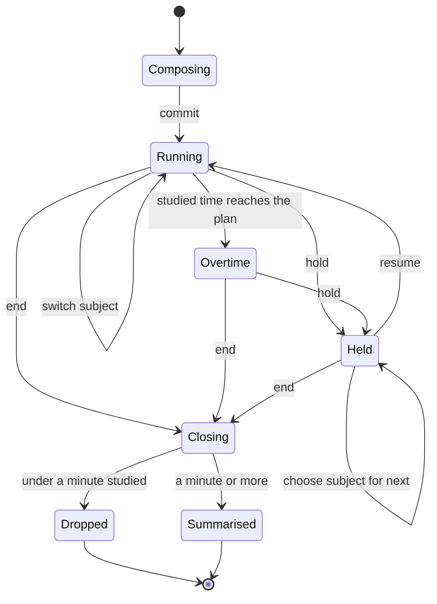

# The session model

Owns: what an interval and a session are, how a session is timed, what
completion means, and the two thresholds that quietly delete data.

## What you see

Nothing. This is the thing every screen is a view onto — but it is worth
describing on its own, because two of its rules are visible only as surprises
somewhere else.

## What a session is made of

One **interval** is an unbroken stretch of study on one subject. It has a start,
usually an end, and — on the first interval of a timed session only — a planned
length. Once its end is set it never changes again.

A **session** is nothing more than the intervals sharing a session id. It is
never stored. Every time the app needs one it walks the intervals and adds them
up. Three things close an interval and open the next:

| You do this | The log gets |
| --- | --- |
| Hold the session | The open interval closed. Nothing opens until you resume. |
| Resume | A new interval, same session, same subject unless one was chosen while held. |
| Switch subject while running | The open interval closed and a new one opened under the new subject, back to back. |
| Switch subject while held | Nothing yet. The choice waits for the next interval, because the closed one may already be on the server. |

## Two clocks, and they disagree

**Studied time** is the sum of the intervals. Held time is not in it — that is
the whole point of the split.

**Span** is wall clock from the session's first start to its last end. Held time
*is* in it.

The countdown a person watches measures **studied time**. Hold a 25-minute
session ten minutes in, go and do something else for half an hour, come back and
the clock still says `15:00`. That is deliberate and it is right for a study
timer.

**Completion is derived from studied time** — the same clock the countdown
showed. A session is Complete when what it studied reaches what it planned.

It used to be derived from the span, which is the same number only for a session
that was never held:

> Study 6 minutes of a planned 25, hold for half an hour, end. Studied time is
> 6 minutes and the countdown still read `19:00`. The span is 36 minutes, so the
> app called the session **Complete** and played the success haptic.

That was [B-02](../bug-triage.md#b-02), now fixed. Holding after a session has
already run to term cannot take completion away again, and a session still
running is never Complete. Every document that mentions Complete links here.

## Two thresholds that delete data

**Under a minute is dropped.** Closing a session with less than 60 seconds of
studied time deletes its intervals and shows no summary. If any of them had
already reached the server, their ids are kept so the next sync can un-tell it. There is no
confirmation, no undo, and — apart from a softer haptic — no acknowledgement
that anything was there. Starting a session by accident and ending it is a
non-event by design.

**Over twelve hours is disowned.** On launch the app looks for an interval left
open. If it started more than twelve hours ago the only plausible explanation is
that the app went away while it was running, so the interval is closed *at its
own start* — its hours are not credited. Inventing study time is treated as
worse than losing it. Any other open interval found at the same time is an
orphan of an earlier launch and gets the same treatment, because an open
interval is measured against *now* wherever the log is read whole, and would go
on growing against today's totals forever.

## The five phases

**Compose.** Nothing exists yet. Subject and length are held in the Start
screen, not in the log.

**Commit.** One interval is inserted, carrying the session id, the subject and
the planned length. If something was already running it is closed and banked
first — silently, and without a summary.

**Run.** Intervals open and close beneath the count. The screen never reads the
log for this: the store keeps one derived summary of the live session and
rebuilds it only when the log changes, because the clock redraws once a second
and the crown far faster.

**Close.** Every open interval is closed at the same instant. The session is
assembled once, and either kept or dropped by the 60-second rule.

**Account.** The intervals stay in the log forever unless discarded. They are
pushed to the server once complete, and never pulled back.

## Variants

| At the start | What differs |
| --- | --- |
| Timed, with subject | Countdown; the subject is on the first interval and every later one until switched. |
| Timed, free | Countdown; every interval carries no subject. |
| Open-ended, with subject | Counts up; no deadline, no alert, no completion. |
| Open-ended, free | Counts up. Nothing marks it but the absence of both. |

| During | What differs |
| --- | --- |
| Held | Studied time stops. The span does not. |
| Subject switched | A new run begins unless the new subject is the one already running, which is a no-op. |
| Overtime | Nothing changes in the log. The session is still running; only the reading changes. |

## Interrupts

| Interrupt | Effect on the session |
| --- | --- |
| Wrist down | None. Intervals are wall-clock records; the app being dimmed does not touch them. |
| Crown press | None to the log. The frontmost hold is given up — see [`surfaces.md`](surfaces.md). |
| Start or end from another surface | The *log* is correct, because both processes write the same database. What is wrong is what each process **believes**: see [B-03](../bug-triage.md#b-03). |
| 4am boundary | None. A session that crosses 4am counts wholly toward the day it started in. |
| Network loss | None. The log is local; sync is a separate, failable pass. |
| Killed and relaunched | The open interval is recovered if it is under twelve hours old, and disowned if not. Everything already closed is untouched. |

## Cross-cutting

**Always-On** — no effect. The model has no display state.

**Typography and numerals** — the model produces seconds; how they read is
[`Format`](../app/running-screen.md#cross-cutting).

**Motion** — none.

**Haptics** — the model fires none. Its callers do.

**Accessibility** — none directly, but the 60-second drop is silent to
everybody, and to a VoiceOver user the absence of a summary is the *only* signal
that a session was ever started.

**What the widgets are told** — every change republishes the snapshot, and
invalidates the session card's relevance when a session starts, ends, or moves
its deadline.

## State diagram

## Open questions and verification

- Whether a session that crosses 4am should still count wholly toward the day it started in is a product call, not a defect. It is stated as a rule in the top-level README and this description takes it as one.
- The 12-hour recovery has never been exercised on a device; it is reachable only by killing the app mid-session and waiting half a day.
- Whether the 60-second drop should be silent is a product call. It is raised as [B-06 note](../bug-triage.md#b-06) only because the same intervals may already be on the server.

Drafted against `watch/` commit `5ac0e35`, and revised after the fixes in [`bug-triage.md`](../bug-triage.md)
