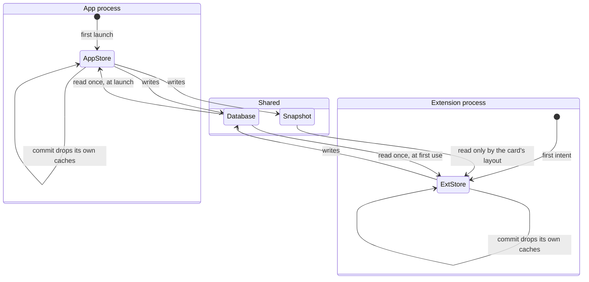

# Surfaces, and what each one can see

Owns: which process is which, what the snapshot is, how relevance works, and the
frontmost hold. This is the document behind the most serious entry in the triage
list, so it is worth reading before any of the widget documents.

## What you see

Four ways in:

| Surface | What it is |
| --- | --- |
| **The app** | Three root screens — Start, Running, Done — plus three sheets. |
| **The complication** | Four families, on a watch face and in the Smart Stack. The day against the goal — and, in `accessoryRectangular`, the running session with an End button. |
| **The Control** | The Action Button, and Siri, and Shortcuts. All three run the same intents. |

## Two processes, one database

The app and the widget extension are **separate processes**. Both compile the
same model layer, both open the same SwiftData store in the shared App Group
container, and both build their own `SessionStore` on first use.

That store is not a thin wrapper. It holds the live session's timing, today's
banked total, the daily aggregations and the subject list in caches that are
dropped when that store commits a change — and, since
[B-03](../bug-triage.md#b-03), when it is told to stop trusting itself.
`refresh()` rolls the context back, re-derives the live session from the log and
drops everything cached. The app calls it whenever the scene becomes active; every
intent calls it before doing anything.

Without it the two processes held different beliefs about a database they agreed
on. Both of these used to happen:

> Start a session in the app, then crown out. The extension is asked to render
> the session card. It reads the *snapshot file*, which is fresh, and draws the
> running session correctly. You tap **End**. That button runs an intent, and
> the intent does not read the snapshot — it read the extension's own
> `SessionStore`. If that store was built before your session started, it
> believed nothing was running, and the button answered "Nothing is running."
> and did nothing.

And the other way round:

> End the session from the card while the app is still alive in the background.
> The database is updated. The app's store was not told. Raise your wrist and
> the app was still on the Running screen, showing a clock that had stopped,
> labelled "Paused" — because a session with no open interval is, as far as that
> screen can tell, held. Tapping Resume inserted a new interval into a session
> that had ended.

Both were [B-03](../bug-triage.md#b-03).

## The snapshot

What the widgets actually read is not the database. It is one small JSON file in
the shared container, rewritten by the app on every state change, off the main
actor so the tap that caused it pays nothing.

It carries: the day's banked total *excluding* the live session, the goal, and —
while a session exists — where the count should read now, the plan, whether it
is held, and the subject's name and colour.

The live count is deliberately expressed as an *instant to count from* rather
than a number of seconds, so the widget can hand it to the system's own timer
text and tick without spending a refresh.

It also carries the study-day it belongs to. Without that, nothing on the
reading side could tell that the 4am boundary had passed since it was written —
[B-07](../bug-triage.md#b-07). A snapshot from the wrong day now reads as zero,
keeping only whatever part of a live session falls after the boundary.

## Relevance

A widget is surfaced in the Smart Stack unasked by claiming a **window** of
relevance — not an event, a window. The session card claims one running from now
to its deadline, or a rolling twenty minutes, whichever is later; the floor
applies to overtime too, where the card matters most and the deadline is already
behind.

The window is claimed as *scheduled* rather than as a plain date range, which is
the documented hint for content that wants acting on. A running session with an
End button on it is exactly that.

Two things make the claim move: whether a session is live, and where it ends.
Only those two invalidate the card's relevance, because a relevance reload is
not free and a subject switch does not change the claim.

The claim belongs to the session rather than to the widget. There is one kind
to invalidate now that the complication and the session card are the same card,
and it claims a window only while something is running: the day's total is
something you go and look at, and a running session with an End button on it is
the one thing here worth putting in front of you unasked.

## The frontmost hold

A watchOS app is put away the moment the wrist drops, and the raise that follows
lands on the watch face. While a session is live the app claims an extended
runtime session so the raise comes back to the count instead — the same bargain
the system Timer makes.

The system's terms, taken as they are:

- It can only be claimed while the app is **active**, so a session started from
  Siri, the Control or the card claims it when the app is *next opened*. There
  is no earlier moment it could.
- **An hour** is the limit. An expiry arriving with the session still running
  claims the next hour.
- **Crowning out ends it.** That is the user leaving on purpose, and the app
  does not ask for it back until it is opened again.

## The five phases

**Compose** exists only in the app. **Commit** can happen from any of the four
surfaces. **Run** is visible on all four, but only the app and the card update
live. **Close** can happen from any surface, and where it happens decides
whether a summary is shown. **Account** is the app's alone.

## Variants

| At the start | What differs |
| --- | --- |
| From the app | The frontmost hold is claimed immediately. A summary is shown when the session closes. |
| From Siri or Shortcuts | Spoken confirmation. No hold until the app is opened. |
| From the Action Button | A start haptic and nothing else. No hold. |
| From the card's Start button | A start haptic. The card redraws as a running session. No hold. |

| During | What differs |
| --- | --- |
| Ended from the app | Lands on the summary. |
| Ended from the card with the app on screen behind it | Lands on the summary, which fires the one haptic. The intent stays quiet when a screen is about to speak — it used to fire success on top, [B-11](../bug-triage.md#b-11). |
| Ended from Siri or the Control | No summary is queued, deliberately: there is no screen to land on. |

## Interrupts

| Interrupt | Effect |
| --- | --- |
| Wrist down | The app keeps the foreground if it had the hold. Widgets refresh on the system's own schedule. |
| Crown press | The hold ends and is not reclaimed until the app is opened again. |
| Session started or ended elsewhere | The database is right and the snapshot is right. The *other process's beliefs* are not: [B-03](../bug-triage.md#b-03). |
| 4am boundary | The app notices on the next read. The widgets do not notice at all: [B-07](../bug-triage.md#b-07). |
| Network loss | No effect on any surface. Sync is separate and allowed to fail quietly. |
| Killed and relaunched | The app rebuilds its store and recovers the open interval. The extension may still be running with a store built before the relaunch. |

## Cross-cutting

**Always-On** — only the app has one. Widgets are drawn by the system.

**Typography** — the complication and the app deliberately spell the same total
differently in one place: a circular complication fits about four characters, so
it says `1.5h` where the app says `1h 30m`. The rectangular family, which has
room, uses the app's spelling.

**Motion** — none outside the app. Widget content is redrawn, never animated.

**Haptics** — intents fire their own, which is what makes them audible from
surfaces with no screen. It is also what makes them fire twice when a surface
*does* have a screen behind it.

**Accessibility** — the rectangular complication carries a full spoken value.
The circular one speaks its compact string, so VoiceOver hears "1.5h" rather
than "1 hour 30 minutes".

**What the widgets are told** — everything above.

## State diagram

## Open questions and verification

- How long a widget extension process actually survives between invocations decides how often [B-03](../bug-triage.md#b-03) bites. It is short but not negligible, and this could not be settled from the code.
- Whether the intents ever run *in-process* for the app — Siri may route either way — changes which store they mutate. This wants a device.
- Whether the frontmost hold changes what `applicationState` reports with the wrist down decides whether ending from the card still lands on a summary: see [B-10b](../bug-triage.md#b-10).
- Nothing here has been observed on a device. The two scenarios above are read from the code and are stated as suspected, not confirmed.

Drafted against `watch/` commit `5ac0e35`, and revised after the fixes in [`bug-triage.md`](../bug-triage.md)
