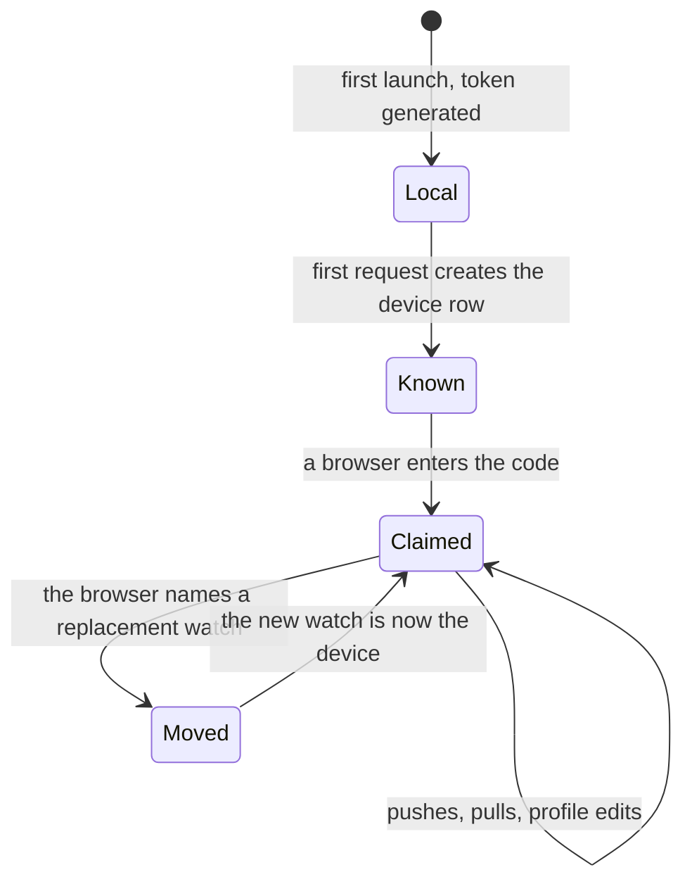

# The sync model

What the server knows, who is allowed to ask, and which side wins when they
disagree.

## What you see

Nothing. Sync has no screen on either side: the watch shows a code once
([`app/pairing.md`](../app/pairing.md)) and the web shows the result
([`web/dashboard.md`](../web/dashboard.md)). Everything here happens between
those two.

## What you can do

Pair a watch to a browser, and — from the browser only — claim a profile and
replace the watch. Nothing else about sync is exposed to anybody.

## The five phases

Sync sits beside the session model rather than inside it. Its own arc is short:

**Compose** — the watch generates a device token on first launch and keeps it.
No server has heard of it yet, and the app is completely usable in that state.

**Commit** — the first sync creates the device row. A push, or opening the
pairing screen, is enough.

**Run** — a pass sends whatever has not been sent: completed intervals, the ids
of intervals discarded since, and any subject changed since the server last saw
one. It reads subjects back, but only when it pushed one or the list is more
than half an hour old — the read is a radio wake for rows that change when
somebody renames something. Three headers ride along on every request — the
token, the watch's timezone, and the daily goal.

A pass runs at launch, when a session ends, when a finished session is
discarded, when the app is backgrounded, and on returning to it with something
unsent — that last for sessions ended by the Action Button, Siri or the Smart
Stack card, which are written by a process with no sync layer in it. Passes are
coalesced: one is in flight at a time.

**Close** — there is no unpairing. The browser's session can be dropped, and a
watch can be retired by [replacing it](../web/replacing-a-watch.md), but a
device row is otherwise permanent.

**Account** — what the server ends up holding is the log, and everything the web
draws is derived from it on read. Nothing is precomputed and nothing is cached
between requests.

### Who owns what

The rule the whole product rests on: **the watch is the author, the web is the
reader.** The watch decides what happened; the server stores it; the web draws
it. There are exactly two exceptions, and both are listed here so they are not
mistaken for a pattern.

| | Owned by | Why |
| --- | --- | --- |
| Intervals | The watch | Only the watch was there. |
| Subjects | Both, last-write-wins | The web can rename one, so both sides can write. |
| Timezone, goal | The watch | They are watch settings; they travel as headers. |
| The profile | **The web** | The watch has no idea it exists. |
| Which watch a profile belongs to | **The web** | A new watch cannot know it is a replacement. |

### Why nothing needs merging

Intervals are append-only and immutable once closed
([`foundations/session-model.md`](session-model.md)), so a resend is not a
conflict — it is the same row arriving twice, and the server ignores the second
one. Ids are generated on the watch and are unique everywhere, so two watches'
logs can be poured into one row without collision. That is what makes
[replacing a watch](../web/replacing-a-watch.md) a move rather than a merge.

Subjects are the only mutable thing, and they settle by comparing `updatedAt`:
an older write is dropped rather than applied. A rename on the web and a rename
on the watch cannot both stick, and the later one wins.

> Technical note: the server is a SQLite database at the edge, so a session's
> local day cannot be worked out in the query the way a full SQL database would
> do it — SQLite has no timezone database. The day bucketing happens in the
> application, using the timezone the watch last sent, which is why that header
> rides on every request rather than being set once at pairing.

### What a failure looks like

Every call the watch makes is allowed to fail quietly, and no screen reports
one. Being offline is the normal case, not an error, and nothing in the app is
gated on it — but quiet is not the same as forgotten. A failed pass is retried
at thirty seconds, two minutes and five while the app is up, and when that is
spent a background refresh is booked, which the system runs whether or not
anyone is looking at the app. Those are a budget rather than a promise: the
guarantee is still the next launch or the next time the app is opened.

Being *refused* is different, and is the one failure that surfaces. A 401 means
this watch's token was taken over by a replacement and will never work again —
permanent, where offline is temporary — so it sets a flag that Settings reports.
A pass that completes clears it, and so does pairing again. The one thing that is *not* retried indefinitely is a
discard — the ids of thrown-away sessions are held in settings and cleared only
once the server has agreed they are gone.

## Variants

| At the start | What differs |
| --- | --- |
| Never paired | The watch still syncs the moment it is asked to pair. A device row exists before any browser has seen it. |
| Paired, browser signed in | The same device, reachable two ways. |
| Paired, browser signed out | The device row and its data are untouched; only the browser lost its way in. |
| Retired watch | Refused, and it says so in Settings rather than looking offline. Its token was taken over by the watch that replaced it. |

| During | What differs |
| --- | --- |
| The watch changes timezone | The next request carries the new one, and every day in the year re-buckets on the next read. Days already drawn can shift. |
| The goal changes on the watch | The next request carries it; the web's goal rate is recomputed against the new one for the whole window, not just from today. |
| The same interval is sent twice | Accepted both times, stored once. |
| A session is discarded on the watch | Its ids are sent, and the rows are deleted. Scoped to the calling device, so an id alone is never enough to delete somebody else's row. |
| Two browsers hold the same session | Both work. There is no notion of one browser being the real one. |

## Interrupts

| Interrupt | Effect |
| --- | --- |
| Wrist down | None. Sync runs on events, not continuously. |
| Crown press | None. |
| Session started or ended elsewhere | None until it is closed; only completed intervals are sent. |
| 4am boundary | None to the record. The day a session lands in was decided when it started, and does not move. |
| Network loss | The push fails, silently, and is retried — three times over the following seven minutes, then by background refresh, then at the next launch. Nothing is lost and nothing is shown. |
| Killed and relaunched | Launch is one of the moments a pass runs, so this costs nothing beyond the wait. |

## Cross-cutting

**Always-On** — nothing; sync has no screen.

**Typography and numerals** — nothing of its own. The web's numerals are
tabular, like the watch's, so a changing number does not shift sideways.

**Motion** — none.

**Haptics** — none, on either side, including on failure.

**Accessibility** — the only thing sync puts in front of anyone is the pairing
code, which the watch spells out character by character.

**What the widgets are told** — nothing. The widget reads the local snapshot and
has never heard of the server.

## State diagram

## Open questions and verification

- Nothing tells the watch it has been paired, or retired. A retired watch simply gets refused on its next launch and stops, showing no sign of it. [B-42](../bug-triage.md#b-32)
- The device token is the only credential in the product. Anyone holding it is the watch, and there is no way to rotate it short of replacing the watch.
- A browser session lasts 400 days and there is no sign-out anywhere in the interface. [B-43](../bug-triage.md#b-33)
- The interval pull is cursored and paged at 500, but the watch never calls it — intervals only travel upward. That remains [B-25](../bug-triage.md#b-25).
- Verified by running the API against a real database: pairing, idempotent push, last-write-wins subjects, the cursored pull, the 4am bucketing in a non-UTC zone, and the 401 paths. See [`verification/web.md`](../verification/web.md).

Drafted against `6213636`, and revised when sync stopped waiting for the next
launch.
