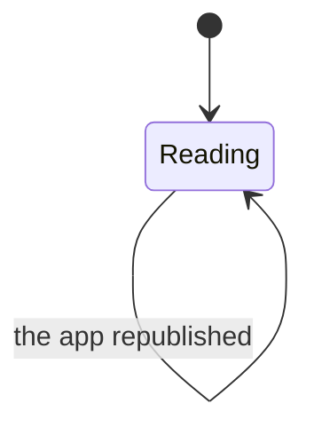

# The complication

Four families of one reading: the day against the goal. In the rectangular
family — the one the Smart Stack shows — that reading gives way to the running
session while there is one, which is the whole of
[`smart-stack.md`](smart-stack.md). One widget, one entry in the gallery, two
things it can be saying.

## What you see

| Family | Layout |
| --- | --- |
| `accessoryCircular` | A capacity gauge with the compact total in the middle |
| `accessoryCorner` | A book glyph with a gauge as its curved label |
| `accessoryRectangular` | "TODAY", the full total at 22pt, a goal bar, and a Start button — or the running session and an End button |
| `accessoryInline` | "1.5h studied" |

Everything is glanceable in under a second, legible in monochrome, and free of
live-ticking seconds wherever the day's total is what is being shown — a
complication that ticks is a complication that costs refreshes for a reading
nobody is watching that closely. The running count is the exception, and it
costs nothing: the system renders it from an interval, not the widget from a
timeline.

The small families stay on the total whatever is running, because the total
already counts it: a session in its tenth minute is ten minutes of the number on
the face. Four characters and a gauge have room for one reading, and the one
that survives being glanced at is the one that answers "how much have I done
today".

## Two spellings, on purpose

The circular family fits about four characters in its centre, so it says `1.5h`.
The rectangular family has room, so it says `1h 30m` — the app's own spelling.
Spending the circular family's thrift on the rectangular one left the card
saying `1.5h` for a total the app was calling `1h 30m`.

The compact spelling drops the decimal past ten hours, because `10.5h` does not
fit either.

## Colour

Every progress surface here is the app's copper — the ring's colour, not the
system's default gauge fill — and it is stated once and handed to all four
families, so the card and the face cannot end up drawing the day in two
different coppers. The numerals stay white, the way the app's own hero numeral
is: the copper is reserved for progress, and the orange accent is reserved for
things you press.

How much of that survives is the system's call, not the app's. A complication is
handed a **rendering mode**:

| Mode | Where | What happens to the colour |
| --- | --- | --- |
| `.fullColor` | The Smart Stack, the widget gallery, faces that render complications in colour | Drawn as asked: copper fill, white numerals |
| `.accented` | A tinted watch face | The view is flattened into two groups and painted in the *face's* tint. The colour asked for is discarded. |

`widgetAccentable()` is what decides the two groups: the numerals and the fill
are in the accented one, the "TODAY" label and the ghost track are not. So there
is no branch in the code — the colour is declared unconditionally and each mode
takes what it can use.

## The goal bar

The rectangular family draws its own bar rather than using a stock linear
capacity gauge, because a stock gauge has no notion of going past full: at 100%
and at 200% it draws the same thing, and this app's central reading laps.

So the bar is the ring's vocabulary in a straight line. The ghost track is
always full width; the fill runs over it; past the goal the completed pass stays
behind at the same dimmed strength the ring uses while the overflow runs over
the top. Both come from the same lap calculation, so the ring and the bar cannot
drift.

The fill is never drawn thinner than it is tall — a capsule narrower than its
own cap radius draws as a sliver rather than as the round end the ring has.

## What you can do

Tap it. It opens the app. The three small families have no buttons; the
rectangular one carries a single Start or End, because it is the Smart Stack
card as well.

## The five phases

For the three small families, only **Account** — they are something you go and
look at. The rectangular family also carries **Commit** and **Close** on its one
button, and claims relevance while a session is running, which is what puts it
in front of you unasked. See [`smart-stack.md`](smart-stack.md).

## Variants

| At the start | What differs |
| --- | --- |
| Nothing studied | An empty gauge and `0m`. |
| Goal met | A full gauge. |
| Goal lapped | The gauge is capped at full — only the rectangular family's hand-drawn bar shows the lap. |
| Tinted watch face | The numerals and the bar are accentable and take the face's tint, in place of the copper; the ghost track does not. |
| Full colour | The gauge and the bar draw in the app's copper, matching the ring on the Start screen. |

| During | What differs |
| --- | --- |
| Session running | The total includes it and advances, because the snapshot carries an instant to count from rather than a number. The rectangular family swaps the total for the session itself. |
| Session held | The total is frozen at the held value. |

## Interrupts

| Interrupt | Effect |
| --- | --- |
| Wrist down | System dimming. |
| Crown press | N/A. |
| Session started or ended elsewhere | Correct at the next refresh — fifteen minutes with a session, thirty without. |
| 4am boundary | The snapshot records the day it was banked in, so one written before the boundary reads as zero rather than as yesterday's total — and the timeline schedules a reload at the boundary itself. [B-07](../bug-triage.md#b-07) |
| Network loss | No effect. |
| App killed and relaunched | No effect. |

## Cross-cutting

**Always-On** — the system's business.

**Typography** — 15pt in the circular centre, 22pt on the rectangular card, both
monospaced. The rectangular label is set in the default face rather than the
rounded one, deliberately: rounded body text reads juvenile at caption sizes.

**Motion** — none.

**Haptics** — none.

**Accessibility** — the rectangular family carries a full spoken value: "1 hour
30 minutes of 2 hours". The circular family does not, so VoiceOver reads the
compact string as written — "1.5h" — which is exactly the reading the compact
spelling exists to avoid having to speak.

**What the widgets are told** — the snapshot, and nothing else. The complication
never opens the database.

## State diagram

## Open questions and verification

- Whether the hand-drawn goal bar reads correctly under every watch-face tint, including the monochrome ones.
- Whether `accessoryCorner`'s curved gauge label shows the lap at all. It cannot — it is a stock gauge, capped at full.
- The circular family's accessibility value is the compact string. Whether that is acceptable or should be the spoken duration is a product call.

Drafted against `watch/` commit `5ac0e35`, and revised after the fixes in [`bug-triage.md`](../bug-triage.md)
