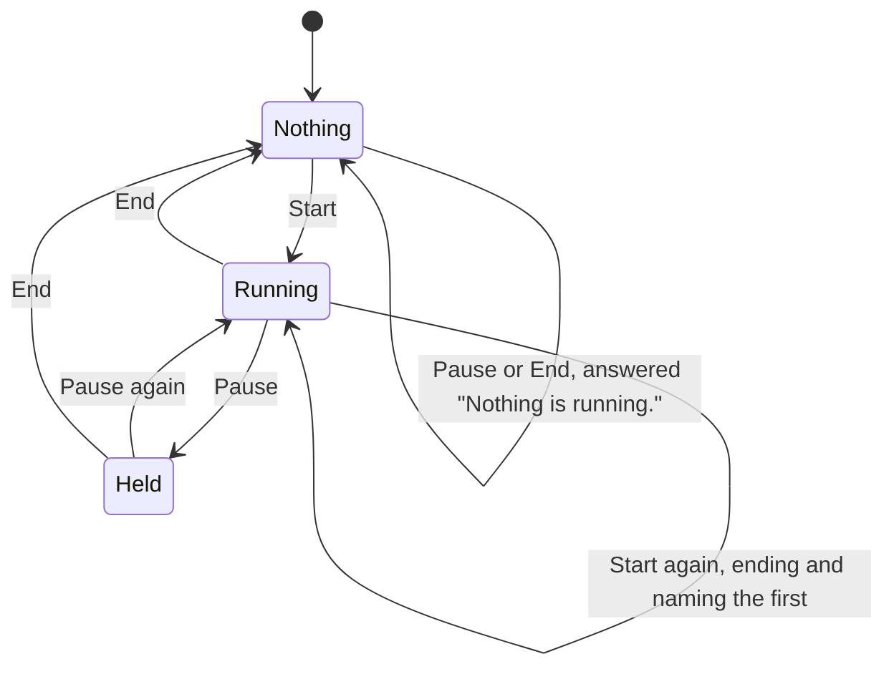

# Intents, Siri and the Action Button

Three actions, behind every surface that is not a screen.

## What you see

Nothing, mostly. That is the point.

| Surface | What it looks like |
| --- | --- |
| Siri / Shortcuts | A spoken confirmation: "Studying Maths for 25m." |
| The Action Button Control | A book glyph labelled "Study". A press, a haptic, no screen. |
| The card's buttons | Covered in [`smart-stack.md`](smart-stack.md). |

Two phrases are registered: "Start studying in Diem" / "Study with Diem", and
"Stop studying in Diem".

## The three intents

**Start Studying** takes an optional subject and an optional duration, so all
four combinations of the session model are reachable by voice. It confirms what
it did, naming whichever of the two were given.

**Pause Studying** toggles. It answers "Resumed." or "Paused.", or "Nothing is
running." — so the same phrase does opposite things depending on state, and the
only way to know which is to hear the answer.

**End Studying** closes the session and reports the studied time, or says "Too
short to keep." for one under a minute.

All three re-read the log before acting. Whichever process is hosting the intent
may have been holding a view of it from before the last change, and nothing
arrives from the other side unasked — see
[`../foundations/surfaces.md`](../foundations/surfaces.md#two-processes-one-database).

None of them opens the app.

## What Start does to a session already running

It ends it, and says so.

Starting while something is running closes and banks the current session first
— which is right, because the user asked for a *new* session and leaving one
queued would put a summary in front of a session that is running. The
confirmation names it: "Ended Maths at 1h 12m. Studying." It used to say only
"Studying.", so a single press of the Action Button could end two hours of study
with the day's total as the only sign. [B-10](../bug-triage.md#b-10).

## The five phases

**Compose** and **Commit** collapse into one utterance. **Run** is unobservable
from here. **Close** works. **Account** is the spoken duration, and nothing else.

## Variants

| At the start | What differs |
| --- | --- |
| Subject and duration given | "Studying Maths for 25m." |
| Subject only | "Studying Maths." |
| Duration only | "Studying for 25m." |
| Neither | "Studying." — preceded by what was ended, if anything was. |
| From the Control | No dialog at all. A start haptic is the whole confirmation. |

| During | What differs |
| --- | --- |
| Ended with the app on screen | Lands on the summary. |
| Ended with the app not on screen | No summary is queued — deliberately, because there is no screen to land on. |
| Ended from the widget extension | Same, decided by checking whether the running bundle is an extension. |

## Interrupts

| Interrupt | Effect |
| --- | --- |
| Wrist down | Intents run regardless. |
| Crown press | N/A. |
| Session started or ended elsewhere | Every intent re-reads the log before acting, so it no longer answers from a stale view: [B-03](../bug-triage.md#b-03). |
| 4am boundary | No effect on the intent. |
| Network loss | No effect. Nothing here touches the network. |
| App killed and relaunched | No effect; the intents run in whichever process hosts them. |

## Cross-cutting

**Always-On** — N/A.

**Typography** — spoken durations use a different formatter from anything drawn:
what reads as `1h 05m` on a screen is heard as "one h oh five m", so anything
spoken drops the padding.

**Motion** — N/A.

**Haptics** — every intent fires one, which is what makes them audible from
surfaces with no screen. End stays quiet when a summary is about to appear and
fire its own, rather than firing on top of it: [B-11](../bug-triage.md#b-11).

**Accessibility** — the spoken dialogs are the accessibility story here, and
they are good. The Control's silence is the gap: a press that does nothing
visible and nothing audible beyond a haptic gives a VoiceOver user no
confirmation of what happened.

**What the widgets are told** — the same as any other change: the snapshot is
republished and relevance invalidated on a start or an end.

## State diagram

## Open questions and verification

- Whether Siri routes these into the app's process or a separate one no longer changes the outcome, since every intent re-reads first: [B-03](../bug-triage.md#b-03).
- Whether a session ended with the wrist down should land on a summary at all. It does now — the test is `.background`, not `.active`, because the frontmost hold makes `.inactive` the ordinary state during a session: [B-10b](../bug-triage.md#b-10). Whether a summary waiting on the next wrist raise is welcome or startling wants a device.
- Whether "Pause Studying" toggling rather than pausing is the right shape for a voice command, where the user cannot see the current state before speaking.

Drafted against `watch/` commit `5ac0e35`, and revised after the fixes in [`bug-triage.md`](../bug-triage.md)
