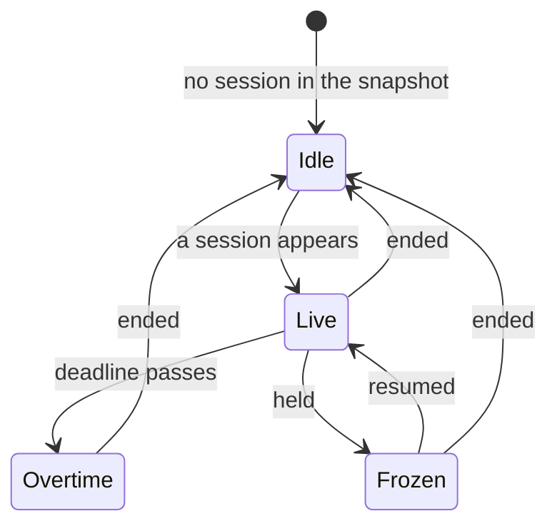

# The session card

The `accessoryRectangular` widget that puts a running session in the Smart
Stack, and gets itself put there unasked.

## What you see

Two layouts, depending on whether anything is running.

**Running** — the subject's name (or "Free") as a caption above a 22pt count,
with a 30pt stop button at the trailing edge. The count is rendered by the
system's own timer text, so it ticks without the widget being refreshed.

**Nothing running** — "TODAY" above the day's total in the compact spelling
(`1.5h`), with a play button.

The buttons are sized as targets rather than as glyphs. At its own size the stop
symbol is a few points across, on a card that also opens the app when missed.

## What the count reads

The same rules the app uses, from the same place, so the two cannot disagree:

| Session | Reads |
| --- | --- |
| Timed, running | Counting down to the deadline |
| Timed, past it | `+` and a count up from the deadline |
| Open-ended | Counting up from the start |
| Held | Frozen, in the shape it stopped in |

The held case is worth stating, because it used to be wrong: the running branch
showed time remaining while the held branch showed studied time, so holding a
25-minute session ten minutes in swapped `15:00` for `10m` — a different number
measuring a different thing, in the same place on the same card.

## How it gets there

The card claims a **window** of relevance for as long as a session exists,
running to the deadline or a rolling twenty minutes, whichever is later. It
claims it as *scheduled*, the documented hint for content that wants acting on.

The window is re-asked for at the moment it changes rather than whenever the
system next gets round to it, because a card whose whole claim is that it
started just now is no use surfaced ten minutes later — and a session that has
ended goes on claiming the stack until the same late answer.

See [`../foundations/surfaces.md`](../foundations/surfaces.md#relevance).

## What you can do

**Tap the button** to start or end. **Tap anywhere else** to open the app.

## The five phases

**Compose** is not possible here: the Start button commits an open-ended, free
session with no way to set either. **Commit** and **Close** both work. **Run** is
what the card mostly shows. **Account** is only the compact total.

The End button is the interesting one. It runs an intent in the widget
extension's process, and that process holds its own view of the database. The
card's *layout* reads the snapshot and is always fresh; the *button* reads the
store, which nothing used to refresh — so it could answer "Nothing is running."
for a session that plainly was. Every intent now re-reads the log before doing
anything. See [B-03](../bug-triage.md#b-03).

## Variants

| At the start | What differs |
| --- | --- |
| Nothing running | Today's compact total and a play button. Starting gives a free, open-ended session. |
| Session running | Subject, count, stop button. |
| Session held | The count is frozen. Nothing else marks it — the card does not say "Paused". |

| During | What differs |
| --- | --- |
| App on screen behind the card | Ending lands on the summary, which fires the one haptic — and the right one. [B-11](../bug-triage.md#b-11) |
| App not on screen | Ending is silent apart from one haptic; no summary is queued. |
| Subject switched in the app | The name changes at the next refresh, up to fifteen minutes later. |

## Interrupts

| Interrupt | Effect |
| --- | --- |
| Wrist down | The system's business. The count is system-rendered and keeps time. |
| Crown press | N/A — the card is not the app. |
| Session started or ended elsewhere | Both the layout and the buttons follow, now that the intents re-read first: [B-03](../bug-triage.md#b-03). |
| 4am boundary | The snapshot carries the day it was written in, so "TODAY" reads zero rather than yesterday's total, and the timeline reloads at the boundary: [B-07](../bug-triage.md#b-07). |
| Network loss | No effect. Everything is local. |
| App killed and relaunched | No effect on the card; the snapshot is a file. |

## Cross-cutting

**Always-On** — the system dims the card. The timer text keeps its own cadence.

**Typography** — 22pt numerals, monospaced, accentable so a tinted watch face
can recolour them. The card deliberately spells the total the way the app does
rather than the compact way the circular complication has to.

**Motion** — none. Widget content is redrawn, never animated.

**Haptics** — whatever the intent fires.

**Accessibility** — both buttons carry labels. The count itself is a plain timer
text with no accessibility label, so VoiceOver reads the raw string.

**What the widgets are told** — this document *is* what they are told.

## State diagram

## Open questions and verification

- Whether the card is genuinely surfaced unasked. This is the whole point of the relevance claim and it has never been observed; it needs a device and a Smart Stack that has not already been pinned.
- Whether `scheduled` outranks the other cards in the stack in practice, or only in the documentation.
- [B-03](../bug-triage.md#b-03) is fixed by re-reading rather than by observing, so a change made *while* an intent runs is still not seen. That window is a few milliseconds and there is no second actor to lose a race with.
- The card does not distinguish a held session from a running one, which is a product call rather than a defect.

Drafted against `watch/` commit `5ac0e35`, and revised after the fixes in [`bug-triage.md`](../bug-triage.md)
