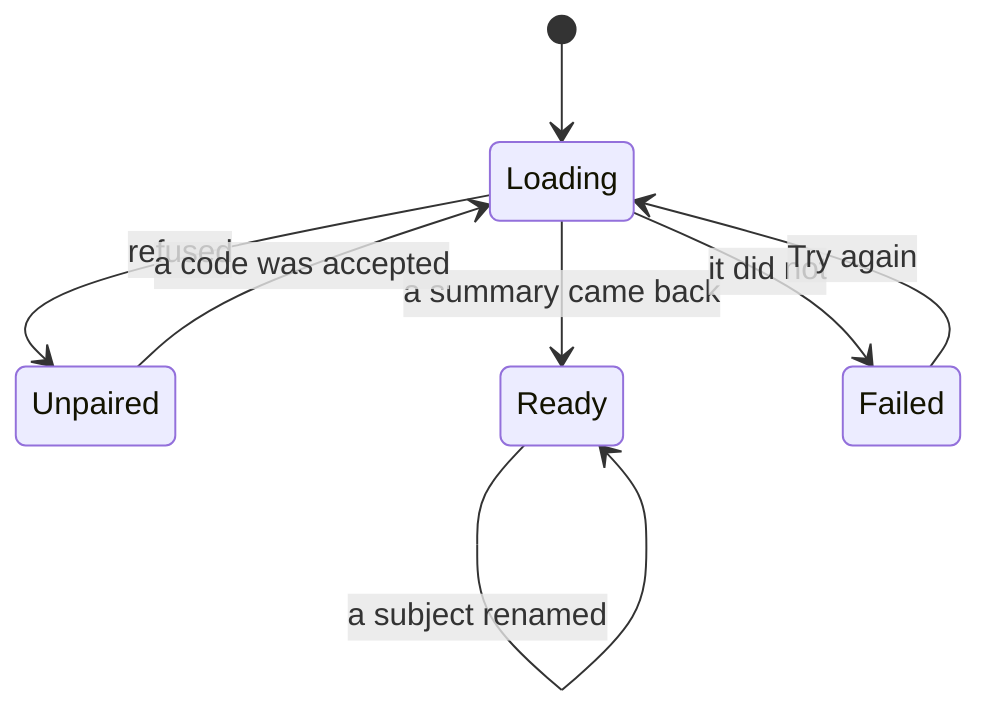

# The dashboard

One page, one read, and the only place the watch's log is shown at length.

## What you see

`diem.ij5.dev`, signed in: a header, three numbers, this week, the year, the
subject list, and — below those — the profile and watch cards that the rest of
this area covers.

| Part | What it is |
| --- | --- |
| Header | "Diem", and under it the date of the first day with anything in it: "A day at a time, since 12 Feb 2026." Before there is one: "Nothing logged yet." |
| Stats | Streak in the accent colour, goal-hit percentage, total hours. |
| This week | Seven bars, Sunday first, each labelled with its initial and its duration. A bar that met the goal is solid; one that did not is the accent at 55%. |
| The year | 371 days as a grid of 11px cells, one column per week, month names above. |
| Subjects | The list, each renameable in place. |
| Footer | "Paired to this browser." and a Sign out button. |

Signed out, the page is a single card: "Pair your watch", the instruction, and a
six-character field.

While it loads, three shimmering blocks stand in for the stats, the bars and the
grid, sized to what is coming so the page does not jump when it arrives.

## What you can do

Pair, if you have not. Rename a subject. Sign out. Everything else on this page
is read only — there is no way to log, edit or delete a session from the web, by
design.

## The five phases

The web never runs a session, so three of the five phases have nothing to do
with it. What it has is the last one.

**Compose** and **Commit** — not here. The web cannot start a session, and there
is no control anywhere on the page that would.

**Run** — a session running on the wrist right now is *not* on this page. Only
closed intervals are sent, so the dashboard shows the day up to the last thing
that finished, and a live session appears when it ends.

**Close** — not here.

**Account** — this is the whole page. The streak, the goal rate, the year and
the week are all derived on read from the intervals the server holds. Nothing is
stored precomputed, so a timezone change or a goal change redraws the whole
history rather than only what came after it.

### Pairing, from this side

The watch shows a code for ten minutes
([`app/pairing.md`](../app/pairing.md)). Typing it here claims it: the browser
gets a session that lasts 400 days, and the page reloads into the dashboard. A
code is single use, and the watch is never told it was used.

A wrong or lapsed code gives one message for both cases — "That code has expired
or was already used" — which is deliberate: distinguishing them would tell an
attacker guessing codes which guesses were real.

### The three numbers

**Streak** counts back from today over consecutive days with anything in them.
Today having nothing in it yet does not break it; yesterday having nothing does,
with no grace day. **Goal hit** is the share of the last thirty days that
reached the goal, which is a different signal from the streak on purpose: a long
streak of ten-minute days scores badly here, and it should. **Total** is the
whole 371-day window in hours, to one decimal.

The day model these all rest on is
[`foundations/day-model.md`](../foundations/day-model.md); the window is a year
plus enough slack for the grid to begin on a week boundary.

### The year

Each cell is one study-day. Its colour is the subject that took the most of that
day; its strength is how much of the goal was met, from 28% at a trace to full
at the goal or beyond. A day of free study has no subject to borrow a colour
from and stays neutral rather than becoming the brightest cell in the grid.

### Keeping up

The summary is worked out when the request is served, so a page left open goes
quietly wrong in two ways: a session ending on the wrist never appears, and past
4am the streak and the last cell of the grid are a day stale. Both are handled,
cheaply. The page refetches when the tab is looked at again — focused, or made
visible — and once more at the next day boundary, which it finds by walking
forward until the study-day's name changes rather than by doing timezone
arithmetic. Nothing polls.

A refresh that fails leaves what is already drawn alone. Only a first load has
nothing to fall back to, and only a first load shows the error card.

### Signing out

The footer clears the session cookie and returns the page to the pairing card.
It does not touch the device or anything on it: the watch goes on syncing, and
entering a fresh code signs the browser back in. [B-43](../bug-triage.md#b-43)

### Renaming a subject

The one write on this page, and the only place in the product where the web and
the watch can both change the same thing. A rename is sent with the moment it
happened, and the later of the two writes wins — see
[`foundations/sync-model.md`](../foundations/sync-model.md). Colour and archived
state are shown but not editable here.

## Variants

| At the start | What differs |
| --- | --- |
| Signed out | The pairing card, nothing else. |
| Signed in, nothing logged | Every number is zero, the grid is empty, and the header reads "Nothing logged yet." |
| Signed in, no subjects | The subject section is empty. Days still colour, neutrally. |
| The server is unreachable | "Something went wrong" and a Try again button. |

| During | What differs |
| --- | --- |
| A session ends on the watch | Nothing, until the page is loaded again. There is no live update. |
| A subject is renamed here | The list is replaced by the server's answer. A write the server dropped as stale is reported rather than silently reverted. |
| The tab is looked at again | The summary is refetched. |
| 4am passes with the page open | The summary is refetched, once. |
| The watch changes timezone | The next load re-buckets the whole year. Days near a boundary can move. |
| The profile is claimed below | The header does not change. The dashboard never shows the display name. |

## Interrupts

| Interrupt | Effect |
| --- | --- |
| Wrist down | Not applicable; this is a browser. |
| Crown press | Not applicable. |
| Session started or ended elsewhere | No effect until reload. |
| 4am boundary | The page does not notice. A dashboard left open across 4am keeps yesterday's day as today until it is reloaded. [B-44](../bug-triage.md#b-34) |
| Network loss | A first load fails into the error card; a refresh fails invisibly and leaves the drawn page alone. A subject rename says it did not reach the server. |
| Killed and relaunched | The session cookie survives; the page comes back signed in. |

## Cross-cutting

**Always-On** — not applicable.

**Typography and numerals** — Inter, with every numeral tabular so a changing
number does not shift sideways. The same rule as the watch.

**Motion** — the loading shimmer, and the week bars growing to height over
350ms. Both are suppressed under reduced motion.

**Haptics** — none.

**Accessibility** — the grid carries an image role and a label rather than 371
unlabelled cells. Each cell's date and duration are on its title. The pairing
field is labelled. Colour is never the only carrier: a day's duration is on its
title and the week's bars are labelled underneath.

**What the widgets are told** — nothing. The web has no path to the watch.

## State diagram

## Open questions and verification

- The page never updates itself. A session that ends on the wrist while the dashboard is open is invisible until a reload, and so is the 4am boundary passing. [B-44](../bug-triage.md#b-34)
- A failed rename says nothing at all — the list quietly stays as it was, which is indistinguishable from the rename having been rejected as stale. [B-45](../bug-triage.md#b-35)
- There is no sign-out. A shared browser stays paired for 400 days. [B-43](../bug-triage.md#b-33)
- Whether the goal-hit window should be thirty days when the grid shows a year is a product call, not a defect.
- The pairing, rename and summary paths were run against a real database; see [`verification/web.md`](../verification/web.md).

Drafted against `6213636`
