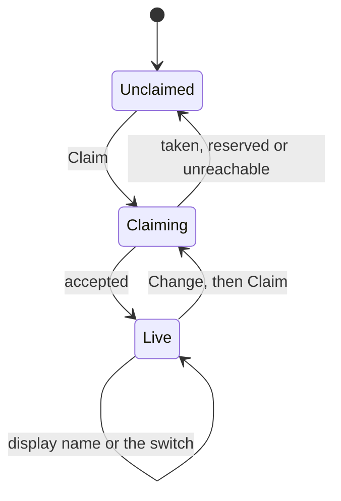

# Claiming a profile

Taking a name, and deciding how much of the year to put behind it.

## What you see

A card under the subject list, headed **Profile**. Before a handle is claimed:

| Part | What it is |
| --- | --- |
| Heading | "Claim your profile" |
| Explanation | What the page will show, that subject names stay private unless you say otherwise, and that the handle can be changed three times. |
| Field | `diem.ij5.dev/` in grey, then an editable handle, then a Claim button. |

After: the card becomes the live profile — "Your profile is live", the address
as a link, a Change button, and under a rule two rows: **Display name**, and
**Show subjects** with a switch. Once the change budget is spent the button is
replaced by the words "No changes left".

## What you can do

Claim a handle, and change it up to three times after that. Set a display name,
or clear it. Turn subjects on and off. There is no way to unpublish a profile:
claiming a handle is the publish step and it has no inverse.

## The five phases

The profile is the one thing on the web that has its own arc rather than
observing the session's.

**Compose** — typing a handle. What is typed is filtered live to what a handle
may contain, so illegal characters never make it into the field, and Claim stays
disabled under three characters.

**Commit** — Claim. The server has the final say on two things the field cannot
check: whether it is reserved, and whether someone already has it.

**Run** — the profile is live. `diem.ij5.dev/{handle}` answers to anyone from
that moment; there is no separate publish step, because a page nobody can find
is the same as no page.

**Close** — a rename moves the page and **retires** the old handle. It is not
returned to circulation: nobody can claim it afterwards, not even the person who
gave it up. Links to it 404 for good, which is the honest outcome — a dead link
is better than one that quietly starts pointing at a stranger's study record
under the name its first owner was known by. [B-46](../bug-triage.md#b-46)

The change budget sits alongside that. A profile gets **three** renames and no
more, which is what makes the warning on the change form mean something.

**Account** — what is published is covered by
[`web/public-profile.md`](public-profile.md).

### What a handle may be

Three to twenty characters, lowercase letters, digits and hyphens, and it may
not begin or end on a hyphen. The form and the server agree on that range; they
used to disagree at the floor, and the server was the lenient one
([B-49](../bug-triage.md#b-49)). Anything typed is lowercased — "Injoon" claims
`injoon` — because the profile is a URL and a URL that only works in one case is
a bad link.

Handles sit at the root of the site, so they compete with every route the
product might ever add. A list of words is held back for that reason: `api`
above all, and around thirty others — `settings`, `about`, `login`, `terms` and
so on. Asking for one gives "That one is spoken for."

### You have to have studied first

A device costs nothing to create — the watch invents its own token and the
server takes it — so without a gate a script could hold every short handle on
the site in minutes. Claiming one therefore requires the device to have logged a
session: "Log a session on your watch before claiming a handle."

For anyone using a watch this is invisible, because they have studied before
they ever open the web. For a squatter it means fabricating a study history per
handle. [B-50](../bug-triage.md#b-50)

### The three changes

The first claim is free. After it, three renames, counted on the device and
shown in the card before each one: "Two changes left." A rename refused because
the handle is taken or reserved does not spend one, and re-submitting the handle
already held is not a change at all. Nothing else on the card is affected when
the budget runs out — the display name and the subjects switch keep working.

### The display name

Optional, up to forty characters, free text. Saved when the field loses focus or
on Enter. Runs of whitespace collapse to single spaces and the ends are trimmed,
so a name cannot be padded into looking different from an identical one. Clearing
it falls back to the handle.

The name is only ever shown on the public page. The dashboard header stays
"Diem" whatever the profile says.

### Show subjects

Off by default, and the default is the point: a profile published without it is
hours, streak and shape, and nothing that says what any of it was for. Turning
it on adds the subject list and lets the year's cells take their subjects'
colours. Turning it back off removes both again on the next load.

There is no third setting. Publishing at all is claiming a handle; how much is
published is this one switch.

## Variants

| At the start | What differs |
| --- | --- |
| No handle yet | The claim form, expanded. |
| Handle claimed | The live card, with the address as a link. |
| Signed out | The whole card is absent — this section only exists on a dashboard that loaded. |

| During | What differs |
| --- | --- |
| The handle is taken | "That handle is taken." The field keeps what was typed. |
| The handle is reserved | "That one is spoken for." |
| The handle is malformed | The field will not accept the characters; under three, Claim stays disabled. |
| Two people claim it at the same instant | One wins. The loser is told it is taken, not shown an error. |
| A save succeeds | "Saved." appears under the card and fades after about a second and a half. |
| The handle was somebody's once | "That handle has been used before and cannot be reclaimed." |
| The device has never logged a session | "Log a session on your watch before claiming a handle." |
| Changing a handle to the one already held | Claim stays disabled; there is nothing to do, and nothing is spent. |
| The third change is used | The Change button is replaced by "No changes left". The rest of the card still works. |
| A fourth change is attempted anyway | 409, "You have used all three handle changes." |

## Interrupts

| Interrupt | Effect |
| --- | --- |
| Wrist down | Not applicable. |
| Crown press | Not applicable. |
| Session started or ended elsewhere | No effect. The profile is independent of the log. |
| 4am boundary | No effect here. The page it publishes re-buckets like any other read. |
| Network loss | "Could not reach the server." The card keeps what was typed, and nothing was sent. |
| Killed and relaunched | The card comes back from the server's copy, not from what was typed. An uncommitted draft is lost. |

## Cross-cutting

**Always-On** — not applicable.

**Typography and numerals** — the handle is set at normal weight with the
address prefix in the faint colour, so the part being typed reads as the only
editable thing in the field.

**Motion** — the switch's knob travels 16px over 180ms on the same curve the
watch's rings use. Suppressed under reduced motion.

**Haptics** — none.

**Accessibility** — the switch is a real checkbox styled as a switch, so it
keeps its role, its keyboard behaviour and its focus ring. Both fields are
labelled, the handle field by an explicit label and the display name by the row
it sits in. Errors are text, not colour alone.

**What the widgets are told** — nothing. The watch has no idea a profile exists.

## State diagram

## Open questions and verification

- A handle cannot be released, and there is no way to unpublish a profile short of never linking to it. That is a deliberate choice about links not rotting, but it means a handle claimed in haste is permanent. [B-46](../bug-triage.md#b-36)
- Nothing warns that changing a handle breaks every existing link to the old one. [B-46](../bug-triage.md#b-36)
- The reserved list is a fixed set. A route added later could collide with a handle already claimed, and nothing detects that.
- Claiming, renaming, the reserved and malformed rejections, and the subjects switch in both positions were run against a real database; see [`verification/web.md`](../verification/web.md).

Drafted against `6213636`
