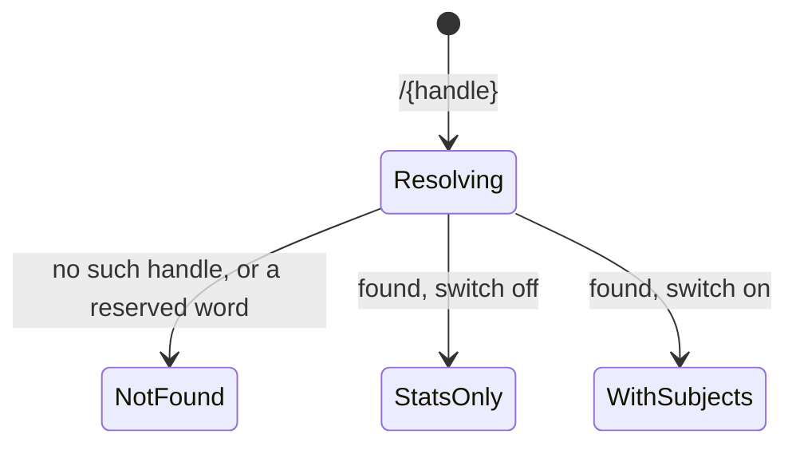

# The public profile

What a stranger sees, and — more to the point — what they do not.

## What you see

`diem.ij5.dev/{handle}`, open to anyone, no session required.

| Part | What it is |
| --- | --- |
| Header | The display name, or the handle if there is none. When there is a name, the handle follows it in faint grey. |
| Under it | "Studying since 12 Feb 2026.", or "Nothing logged yet." |
| Stats | Streak, goal hit, total — the same three readings as the dashboard, the same way round. The goal rate carries the goal it is measured against underneath it. |
| This week | The same seven bars. |
| The year | The same grid, drawn in the accent colour instead of by subject. |
| Subjects | Only when the owner opted in: the names as pills, each with its colour. |
| Footer | A rule, then "Diem — a study timer for Apple Watch." linking home. |

The page is rendered on the server rather than fetched in the browser, because a
profile is a link people send each other and a link that opens on a spinner is a
worse link. It is cached for a minute.

## What you can do

Read it. Follow the footer to the product. There is nothing interactive on the
page — no follow, no comment, no comparison against anybody else.

## The five phases

The page is the **Account** phase and nothing else: it is the log, totalled, for
somebody who was not there. It has no controls, so it cannot compose, commit,
run or close anything.

### What "stats only" actually withholds

The default is not a softened view of the full page — it is a different payload.
With the switch off, the server does not send the subject list, and it also
strips the subject from every day before sending it. Both matter: a year
coloured by subject is a subject list with extra steps, and sending ids without
names would still leak how many subjects there are and which days share one.

What remains is the streak, the hours, the goal rate, and the shape of the year
in a single colour. What that still tells a reader is real — when they study,
how much, and how consistently — and anyone claiming a handle should expect it
to.

With the switch on, the subject list appears and the grid takes each day's
dominant colour. Archived subjects are left out; deleted ones were already gone.

### The goal rate is somebody else's goal

The percentage is measured against the owner's daily goal, which is not shown
anywhere on the page. Two profiles reading 80% may be measuring against two
hours and against fifteen minutes. This is not a defect so much as a number that
cannot be compared between people, presented in a way that invites it.
[B-47](../bug-triage.md#b-37)

### Link previews

The page carries a title, a description and Open Graph tags built from the same
two numbers — "A 12-day streak and 48.3 hours studied." These are emitted
whether or not subjects are shown, and never name a subject.

## Variants

| At the start | What differs |
| --- | --- |
| Handle does not exist | The 404 page: the status, "Nothing here.", and a link home. |
| Handle in the wrong case | The same page. Handles resolve lowercased. |
| A reserved word | 404, not a hint that the word is reserved. |
| Display name set | The name leads, the handle follows in grey. |
| No display name | The handle leads alone, with no second line. |
| Nothing logged yet | The stats read zero and the grid is empty; the page still exists. |

| During | What differs |
| --- | --- |
| The owner turns subjects off | The next load after the cache lapses drops the names and the colours. |
| The owner renames the handle | The old address 404s for good. It is retired rather than freed, so it can never resolve to anybody else. There is no redirect. [B-46](../bug-triage.md#b-46) |
| The owner's watch is replaced | Nothing visible. The page is the profile's, not the watch's. |
| A session ends on the owner's wrist | Appears on the next load past the one-minute cache. |

## Interrupts

| Interrupt | Effect |
| --- | --- |
| Wrist down | Not applicable. |
| Crown press | Not applicable. |
| Session started or ended elsewhere | Not visible until reload; only closed intervals reach the server at all. |
| 4am boundary | The page is bucketed in the owner's timezone, not the reader's, so a reader in another zone sees the owner's days. |
| Network loss | The reader gets their browser's error; nothing is rendered by the app. |
| Killed and relaunched | Nothing to lose; the page holds no state. |

## Cross-cutting

**Always-On** — not applicable.

**Typography and numerals** — the same tabular numerals and the same three-stat
row as the dashboard, deliberately, so the two pages read as one product.

**Motion** — the week bars grow on load. Nothing else moves.

**Haptics** — none.

**Accessibility** — the grid keeps its image role and per-cell titles. The
subject pills carry their colour as a dot beside the name, never as the only
distinction between them. Contrast holds in both light and dark, which the page
follows from the reader's system rather than the owner's.

**What the widgets are told** — nothing.

## State diagram

## Open questions and verification

- The goal-hit percentage is measured against a goal the page does not show, so it reads as comparable between people when it is not. [B-47](../bug-triage.md#b-37)
- Renaming a handle leaves every shared link dead with no redirect. [B-46](../bug-triage.md#b-36)
- "Stats only" still discloses study times and consistency at day resolution. That is the intended trade, but nothing on the claim form says so in those words.
- There is no way to take a profile down once it is up.
- Both switch positions were checked against a real database, including that no subject name or subject id appears anywhere in the stats-only HTML; see [`verification/web.md`](../verification/web.md).

Drafted against `6213636`
