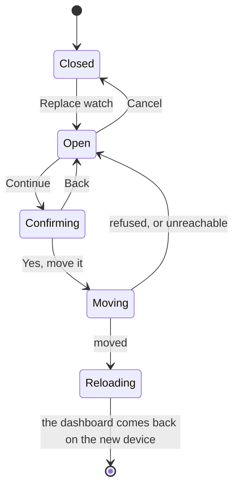

# Replacing a watch

The one thing the web is genuinely in charge of.

## What you see

A card at the bottom of the dashboard, headed **Watch**. At rest it is one line —
"Got a new watch? Move your history, your streak and your profile across." — and
a Replace watch button.

Opened, it becomes an instruction and a six-character field: install Diem on the
new watch, open *Pair with Web* in its settings, and type the code it shows. The
button reads Continue, and it commits nothing — it opens the confirmation.

## What you can do

Move everything onto a new watch, from the browser, once the new watch has shown
a code. Cancel before committing. There is no way back afterwards.

## The five phases

**Compose** — opening the card and typing the new watch's code. Nothing has
happened yet, and Cancel leaves no trace.

Continue opens a second step headed with the code being moved to — "Move
everything to PDT8QQ?" — which says what moves, that this watch stops syncing
from that moment, that anything it has not sent stays on it, and that there is no
undo. Back returns to the field.

**Commit** — "Yes, move it". This is the irreversible moment, and it is now two
deliberate presses away rather than one. [B-48](../bug-triage.md#b-48)

**Run** — the move itself, which is one step on the server rather than a
progress bar. Either all of it happened or none of it did.

**Close** — the dashboard reloads from scratch, because the device underneath it
has changed and nothing on screen can be trusted to still be about the same
watch.

**Account** — the new watch is now the device. Its next sync sees the whole
history; the old watch's next sync is refused.

### What actually moves

Not the profile — the **token**. The device row keeps its identity, and with it
every interval, every subject, the handle and the display name. What changes is
which watch is allowed to speak for it: the row adopts the new watch's token,
and the row the new watch made when it paired is folded in and dropped.

The consequence worth stating plainly: **anything the new watch had already
logged comes along.** A watch that was used for a week before being made the
replacement does not lose that week. Interval and subject ids are generated on
the watch and are unique everywhere, so the two logs pour into one without
colliding — see [`foundations/sync-model.md`](../foundations/sync-model.md).

The browser's own session is re-issued at the same moment, because the cookie
holds the token and the token just changed. The page stays signed in.

### What is lost

The old watch. Its token now matches nothing, so its next sync is refused and it
stops — silently, with nothing on its screen to say so. Anything it had not yet
pushed at that moment is stranded on it for good.
[B-42](../bug-triage.md#b-32)

### Why the web has to be the one to do it

A new watch cannot know it is a replacement. It generates a token, it has no
history, and nothing distinguishes it from a first watch. Only the browser
holding the old session can assert that these two watches are the same person,
which is why this is the single write the web owns outright and the only place
the "watch is the author" rule is set aside.

## Variants

| At the start | What differs |
| --- | --- |
| Not signed in | The card is absent along with the rest of the dashboard. |
| No profile claimed | Works identically. The profile is not a precondition. |
| The new watch has never synced | It has no code to show, and the flow cannot start. |
| The new watch has already logged sessions | They come across too. |

| During | What differs |
| --- | --- |
| The code is expired or already used | "That code has expired or was already used." Nothing moved. |
| The code belongs to the watch already in use | Accepted, and reported as done, but nothing moved. |
| The code is malformed | Continue stays disabled under six characters. |
| Back is pressed at the confirmation | The field returns with the code still in it. Nothing was sent. |
| Network loss mid-request | "Could not reach the server." The move either completed or did not; the card cannot say which, and reloading the dashboard is how you find out. [B-48](../bug-triage.md#b-38) |
| Cancel | The card closes. Nothing was sent. |

## Interrupts

| Interrupt | Effect |
| --- | --- |
| Wrist down | Not applicable. |
| Crown press | Not applicable. |
| Session started or ended elsewhere | A session running on the old watch when the move happens is lost — it was never sent, and the watch it lives on is now refused. |
| 4am boundary | No effect. Days are bucketed on read and the record does not move. |
| Network loss | See the table above. |
| Killed and relaunched | The card is closed and the typed code is gone. Whether the move happened is answered by reloading. |

## Cross-cutting

**Always-On** — not applicable.

**Typography and numerals** — the code field uses the same wide tracking and
tabular numerals as the pairing field, because it is the same kind of thing
being transcribed.

**Motion** — none.

**Haptics** — none.

**Accessibility** — the field is labelled "Pairing code from the new watch"
rather than reusing the pairing label, so a screen reader can tell the two
six-character fields on the page apart. The confirmation is a heading and a
paragraph rather than a native dialog, so it reads in document order.

**What the widgets are told** — nothing, on either watch.

## State diagram

## Open questions and verification

- The old watch is never told. It goes on working locally and quietly stops syncing, and anything unpushed on it at that moment is stranded. [B-42](../bug-triage.md#b-32)
- There is no confirmation step in front of an irreversible action, and no undo behind it. The instruction says the old watch stops syncing; nothing makes you acknowledge it. [B-48](../bug-triage.md#b-38)
- A request that fails after the server acted leaves the card unable to say what happened. Retrying with the same code is safe — it will simply be refused as used — but nothing says so.
- The move was run end to end against a real database, including a new watch that had already logged a session, and confirmed: three intervals and one subject on one device row, no orphans, the old token refused, the browser session still valid, and the profile intact. See [`verification/web.md`](../verification/web.md).

Drafted against `6213636`
